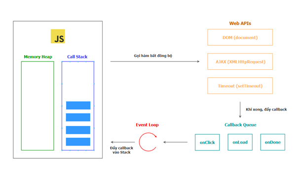

# 🟡 **I JavaScript Asynchronous Diagram**



| **Component**      | **Description**                                                                         |
| ------------------ | --------------------------------------------------------------------------------------- |
| **Memory Heap**    | Where variables and objects are stored.                                                 |
| **Call Stack**     | Where synchronous JS code is executed (LIFO – Last In, First Out).                      |
| **Web APIs**       | Asynchronous APIs provided by browser (DOM, AJAX, Timer, ...).                          |
| **Callback Queue** | Queue for callbacks from Web APIs after completion (Task Queue / Macro-task).           |
| **Event Loop**     | Continuously checks Call Stack and pushes tasks from the Queue when the Stack is empty. |

---

## 🚦 **How the Flow Works**

1. Asynchronous functions (**setTimeout**, **AJAX**, **DOM events**, ...) are called and handled by **Web APIs**.
2. When a **Web API** finishes, its callback is pushed to the **Callback Queue**.
3. The **Event Loop** keeps checking:
   - If the **Call Stack** is empty, it pushes the next callback from the **Queue** to the Stack for execution.
4. This process repeats until there are no more tasks.

> **Note:**
>
> - JavaScript has only **one Call Stack** (single-threaded), but thanks to this mechanism, it can handle multiple asynchronous tasks smoothly.
> - **Callback Queue** ≈ **Task Queue** (macro-task).
> - **Microtask Queue** (Promise, MutationObserver, ...) has **higher priority** than Callback Queue but is not shown in this diagram.

---

# 🟡 **II Cách sử dụng `this` trong JavaScript (có giải thích ví dụ)**

Dưới đây là tổng hợp chi tiết về cách sử dụng và ý nghĩa của `this` trong JavaScript, dựa trên tài liệu xác minh từ [MDN Web Docs – this](https://developer.mozilla.org/en-US/docs/Web/JavaScript/Reference/Operators/this) và [ECMAScript specification](https://tc39.es/ecma262/#sec-this-keyword):

---


## 1. `this` là gì?

`this` là một từ khóa đặc biệt trong JavaScript, đại diện cho **ngữ cảnh thực thi (execution context)** hiện tại – cụ thể là đối tượng mà hàm đang được gọi thông qua nó.

---

## 2. Ý nghĩa của `this` phụ thuộc vào cách gọi hàm

### a. Trong hàm thông thường (non-strict mode)

```javascript
function show() {
  console.log(this);
}
show(); // this === window (trình duyệt) hoặc global (Node.js)
```
Khi gọi một hàm thông thường ở chế độ không strict, `this` mặc định là đối tượng toàn cục (`window` trên trình duyệt, `global` trên Node.js).

---

### b. Trong strict mode

```javascript
"use strict";
function show() {
  console.log(this);
}
show(); // this === undefined
```
Trong strict mode, khi gọi hàm thông thường, `this` sẽ là `undefined` thay vì tham chiếu đến đối tượng toàn cục.

---

### c. Trong phương thức của object

```javascript
const obj = {
  name: 'Loi',
  show: function() {
    console.log(this.name);
  }
};
obj.show(); // this === obj => 'Loi'
```
Khi gọi một method thông qua object (obj.show()), `this` trỏ đến chính object đó (`obj`), nên `this.name` sẽ in ra `'Loi'`.

---

### d. Trong constructor function

Khi sử dụng `new`, hàm sẽ tạo một object mới và `this` bên trong hàm sẽ trỏ đến object mới đó.
```javascript
function Person(name) {
  this.name = name;
}
const p = new Person('Loi');
console.log(p.name); // 'Loi', this === p
```

---

### e. Trong class (ES6)

```javascript
class Animal {
  constructor(name) {
    this.name = name;
  }
  speak() {
    console.log(this.name);
  }
}
const dog = new Animal('Muc');
dog.speak(); // this === dog => 'Muc'
```
Tương tự constructor function, `this` trong class sẽ trỏ đến instance vừa được tạo, nên `this.name` sẽ truy cập tên của đối tượng.

---

## 3. Thay đổi `this` bằng `call`, `apply`, `bind`

```javascript
function greet() {
  console.log('Hello', this.name);
}
const user = { name: 'Loi' };
greet.call(user); // Hello Loi
greet.apply(user); // Hello Loi
const greetUser = greet.bind(user);
greetUser(); // Hello Loi
```
`call`, `apply`, và `bind` cho phép chỉ định cụ thể giá trị của `this` khi gọi hàm.  
- `call` và `apply` gọi hàm ngay lập tức với `this` là `user`.
- `bind` trả về một bản sao của hàm với `this` cố định là `user`.

---

## 4. `this` trong arrow function

- Arrow function **không có ngữ cảnh `this` riêng**.
- `this` bên trong arrow function sẽ lấy từ hàm cha gần nhất.

```javascript
const obj = {
  name: 'Loi',
  show: function() {
    const arrow = () => {
      console.log(this.name);
    };
    arrow();
  }
};
obj.show(); // 'Loi'
```
Arrow function không có `this` riêng, nó "kế thừa" `this` từ hàm chứa nó (`show`).  
Vì `show` là method của `obj`, nên `this.name` vẫn là `'Loi'`.

---

## 5. Một số trường hợp đặc biệt

### a. Khi truyền method làm callback

Khi truyền trực tiếp method của object cho hàm khác (như setTimeout), ngữ cảnh object bị mất, nên `this` không còn trỏ về `obj` nữa.
```javascript
const obj = {
  name: 'Loi',
  show: function() {
    console.log(this.name);
  }
};
setTimeout(obj.show, 1000); // undefined (trong strict mode) hoặc window.name nếu không strict
```

**Giải pháp:** Dùng arrow function hoặc bind:

Sử dụng arrow function hoặc bind sẽ giữ đúng ngữ cảnh `this` là `obj`.
```javascript
setTimeout(() => obj.show(), 1000);
```
hoặc
```javascript
setTimeout(obj.show.bind(obj), 1000);
```

---

## 6. Trong DOM event handler

Khi xử lý sự kiện DOM bằng function thông thường (không phải arrow), `this` sẽ trỏ đến phần tử DOM kích hoạt sự kiện.
```javascript
const btn = document.querySelector('button');
btn.onclick = function() {
  console.log(this); // this === btn
};
```

---

## 7. Tóm tắt bảng tra cứu `this`

| Cách gọi                                         | `this` là gì?                             |
|--------------------------------------------------|-------------------------------------------|
| Hàm thường (non-strict)                          | Đối tượng global (window/global)          |
| Hàm thường (strict mode)                         | undefined                                 |
| Method thuộc object                              | Chính object đó                           |
| Constructor (dùng `new`)                         | Đối tượng mới được tạo                    |
| Arrow function                                   | `this` của scope bên ngoài                |
| Dùng `call`, `apply`, `bind`                     | Đối tượng được truyền vào                 |
| DOM event handler                               | Phần tử DOM kích hoạt sự kiện             |

---

**Nguồn:**  
- [MDN Web Docs – this](https://developer.mozilla.org/en-US/docs/Web/JavaScript/Reference/Operators/this)  
- [ECMAScript specification – this](https://tc39.es/ecma262/#sec-this-keyword)
