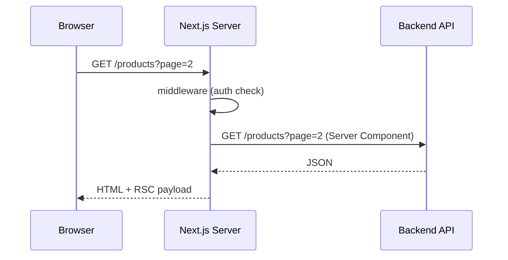

# 1. App Router — Chi tiết

App Router (từ Next.js 13+) dùng thư mục `app/` để định nghĩa **route**, **layout**, **loading**, **error** theo cấu trúc file.

---

## 1.1 File-based routing

Mỗi thư mục trong `app/` tương ứng một **segment** URL.

| File / thư mục | URL | Vai trò |
|----------------|-----|---------|
| `app/page.tsx` | `/` | Trang gốc |
| `app/about/page.tsx` | `/about` | Trang con |
| `app/products/[slug]/page.tsx` | `/products/iphone-15` | Dynamic segment |
| `app/api/checkout/route.ts` | `/api/checkout` | API (Route Handler) |

**Quy tắc đặc biệt:**

- `page.tsx` — UI cho route (bắt buộc để route public được)
- `layout.tsx` — UI bọc các route con, **giữ state** khi navigate
- `loading.tsx` — UI loading (Suspense boundary)
- `error.tsx` — Error boundary (client component)
- `not-found.tsx` — 404 cho segment đó
- `route.ts` — Route Handler (API), không có `page.tsx` cùng segment

---

## 1.2 Route Groups `(tên)`

Thư mục `(dashboard)`, `(shop)` **không xuất hiện trên URL** — chỉ để tổ chức code và chia layout.

```text
app/
├── (shop)/layout.tsx      → layout cho shop
├── (dashboard)/
│   ├── layout.tsx         → layout dashboard (cùng ShopShell trong Nova Shop)
│   └── products/page.tsx  → URL vẫn là /products
```

**Khi nào dùng:** nhiều “khu vực” app (marketing vs app vs admin) với layout/nav khác nhau.

---

## 1.3 Layout lồng nhau (Nested Layouts)

```text
app/layout.tsx           → <html><body> + Providers
  └── (dashboard)/layout.tsx  → <ShopShell>
        └── products/page.tsx
```

- Layout **cha** render một lần; layout **con** re-render khi đổi route con.
- Dùng cho: sidebar cố định, navbar, font global.

**Nova Shop — root layout:**

```tsx
// app/layout.tsx — font, metadata, SessionProvider
<html>
  <body className={inter + outfit}>
    <Providers>{children}</Providers>
  </body>
</html>
```

---

## 1.4 Dynamic Routes

| Pattern | Ví dụ URL | `params` |
|---------|-----------|----------|
| `[slug]` | `/products/abc` | `{ slug: "abc" }` |
| `[...slug]` | `/blog/a/b/c` | catch-all |
| `[[...slug]]` | optional catch-all |

**Next.js 15:** `params` và `searchParams` trên page là **Promise** — phải `await`:

```tsx
export default async function Page(props: {
  searchParams?: Promise<Record<string, string | undefined>>;
}) {
  const raw = (await props.searchParams) ?? {};
  const page = Number(raw.page) || 1;
}
```

---

## 1.5 searchParams — lọc, phân trang, sort

State “share được qua URL” — refresh vẫn giữ filter.

```tsx
// ?category=smartphones&sort=price-low&page=2
const filters = parseProductFilters(await searchParams);
const result = await getProducts({ ...filters });
```

**Ưu điểm:** bookmark, SEO (một phần), back/forward browser.

---

## 1.6 `<Link>` và prefetch

- `<Link href="/products">` — client navigation, không full reload.
- Production: Next.js **prefetch** route khi link vào viewport.
- So với SPA thuần: code split **theo route**, không load hết app lần đầu.

---

## 1.7 Metadata (SEO)

```tsx
import { Metadata } from "next";

export const metadata: Metadata = {
  title: { template: "%s | NOVA", default: "NOVA" },
  description: "...",
};

// Hoặc dynamic:
export async function generateMetadata({ params }): Promise<Metadata> {
  const product = await getProduct(params.id);
  return { title: product.name };
}
```

Chi tiết SEO: xem [SEO.md](./SEO.md).

---

## 1.8 Sơ đồ request một trang



---

## 1.9 Checklist khi tạo route mới

1. Đặt `page.tsx` đúng segment URL mong muốn.
2. Cần shell chung? → `layout.tsx` ở segment cha.
3. Data trên server? → async Server Component + service layer (`app/lib/services/`).
4. Tương tác (click, form state)? → tách Client Component nhỏ.
5. Route cần đăng nhập? → cấu hình `auth.config` + middleware.

---

## Bài tập tư duy

1. `(shop)` và `(dashboard)` cùng map `/products` được không? → Không, trùng URL; route group chỉ chia layout nếu **cùng path** không trùng file `page.tsx`.
2. Tại sao `searchParams` nên parse qua hàm `parseProductFilters` thay vì đọc trực tiếp mọi nơi? → Một nguồn truth, validate, default an toàn.
