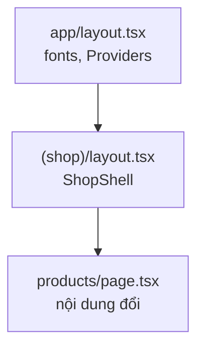
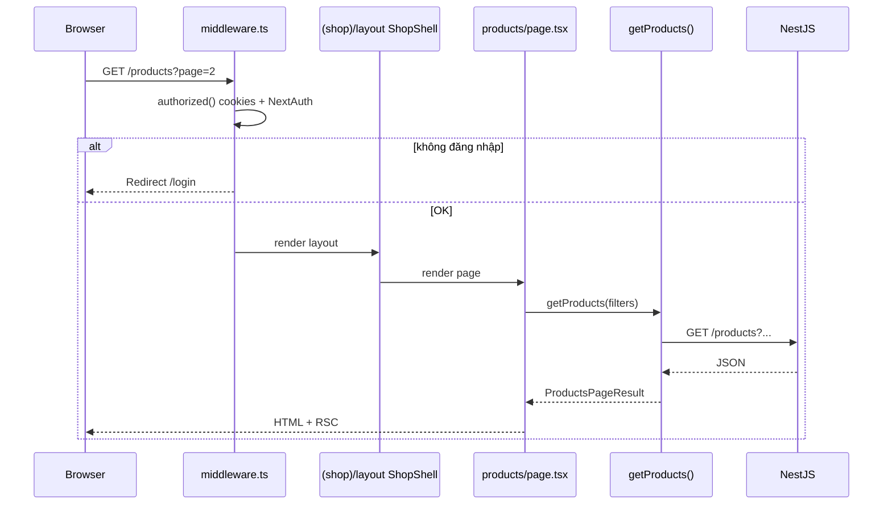

# 1. App Router — Hướng dẫn chi tiết

Tài liệu giải thích **cách Next.js 15 map URL → file trong `app/`**, và **cách Nova Shop** tổ chức route shop, checkout, API.

**Đọc theo thứ tự:** Mục 1 → 2 (cấu trúc file) → 3–6 (layout, dynamic, URL state) → 7 (Nova) → 8 (FAQ).

**Docs chính thức:** [Routing](https://nextjs.org/docs/app/getting-started/routing) · [Project structure](https://nextjs.org/docs/app/getting-started/project-structure) · [Upgrading v15](https://nextjs.org/docs/app/guides/upgrading/version-15)

---

## Mục lục

1. [Vấn đề App Router giải quyết](#1-vấn-đề-app-router-giải-quyết)
2. [Cây thư mục `app/` trong Nova Shop](#2-cây-thư-mục-app-trong-nova-shop)
3. [File conventions — mỗi file làm gì?](#3-file-conventions--mỗi-file-làm-gì)
4. [Route groups `(shop)` — URL không đổi](#4-route-groups-shop--url-không-đổi)
5. [Nested layouts — shell giữ nguyên khi navigate](#5-nested-layouts--shell-giữ-nguyên-khi-navigate)
6. [Dynamic routes & Next.js 15 `params` Promise](#6-dynamic-routes--nextjs-15-params-promise)
7. [`generateStaticParams` — prebuild trang sản phẩm](#7-generatestaticparams--prebuild-trang-sản-phẩm)
8. [`searchParams` — filter trên URL](#8-searchparams--filter-trên-url)
9. [`loading`, `error`, `not-found`](#9-loading-error-not-found)
10. [Luồng request: GET `/products`](#10-luồng-request-get-products)
11. [FAQ & bài tập](#11-faq--bài-tập)
12. [Bản đồ file](#12-bản-đồ-file)

---

## 1. Vấn đề App Router giải quyết

**Pages Router (cũ):** `pages/products.tsx` → `/products` — quen thuộc nhưng khó chia layout lồng, data fetching rời rạc.

**App Router (mới):** Mỗi **folder** = một **segment** URL; mỗi segment có thể có `layout`, `page`, `loading`, `error` riêng.

| Nhu cầu | App Router |
|---------|------------|
| Navbar cố định, chỉ đổi nội dung giữa | `layout.tsx` cha không re-mount |
| Skeleton khi load chậm | `loading.tsx` hoặc `<Suspense>` |
| Bắt lỗi từng khu vực | `error.tsx` |
| API nội bộ (Stripe webhook) | `route.ts` song song `page.tsx` |
| SEO / metadata từng trang | `export const metadata` |

---

## 2. Cây thư mục `app/` trong Nova Shop

```text
app/
├── layout.tsx              → <html><body> + Providers (toàn app)
├── page.tsx                → /  (landing + ShopShell inline)
├── error.tsx, global-error.tsx
├── (shop)/
│   ├── layout.tsx          → ShopShell (navbar + footer)
│   ├── error.tsx
│   ├── products/
│   │   ├── page.tsx        → /products
│   │   ├── error.tsx
│   │   └── [slug]/
│   │       ├── page.tsx    → /products/iphone.123
│   │       └── error.tsx
│   ├── cart/page.tsx       → /cart
│   └── customers/page.tsx  → /customers
├── login/page.tsx          → /login (layout riêng, không ShopShell group)
├── checkout/
│   ├── layout.tsx          → ShopShell
│   ├── success/page.tsx
│   └── cancel/page.tsx
└── api/
    ├── auth/[...nextauth]/route.ts
    ├── checkout/route.ts
    ├── checkout/cart/route.ts
    └── stripe/webhook/route.ts
```

**Ghi nhớ:** Thư mục `(shop)` **không** xuất hiện trên URL — chỉ là nhóm tổ chức.

---

## 3. File conventions — mỗi file làm gì?

| File | Bắt buộc? | Vai trò |
|------|-----------|---------|
| `page.tsx` | Có (để route public) | UI cho URL đó — thường **Server Component** `async` |
| `layout.tsx` | Không | Bọc `children`; **giữ state** khi đổi route con |
| `loading.tsx` | Không | UI loading tự động (Suspense boundary) |
| `error.tsx` | Không | Error boundary — **phải** `"use client"` |
| `not-found.tsx` | Không | UI khi gọi `notFound()` |
| `route.ts` | Không | Route Handler — **không** cùng segment với `page.tsx` |
| `export const dynamic` / `revalidate` / … | Không | **Route segment config** — quy tắc static/ISR/dynamic cho cả folder ([file 5 §13](./5.%20Data%20Fetching%20va%20Cache.md#13-route-segment-config--vai-trò--mối-liên-hệ-cache)) |

### Quy tắc vàng

```text
Cùng một folder KHÔNG được vừa page.tsx vừa route.ts
→ Nova đặt API dưới app/api/*
```

---

## 4. Route groups `(shop)` — URL không đổi

```text
app/(shop)/products/page.tsx  →  URL: /products   (không phải /shop/products)
app/(marketing)/about/page.tsx →  URL: /about
```

**Dùng khi:** Cần **layout khác nhau** cho các nhóm route mà URL không cần prefix.

Nova: `(shop)/layout.tsx` bọc `ShopShell` cho catalog, cart, customers.

**Lỗi thường gặp:** Hai group cùng định nghĩa `products/page.tsx` → **trùng URL**, build lỗi.

---

## 5. Nested layouts — shell giữ nguyên khi navigate



| Hành vi | Giải thích |
|---------|------------|
| User `/products` → `/cart` | `ShopShell` (navbar) **không** unmount — chỉ `children` đổi |
| User `/` → `/products` | Root layout giữ; có thể đổi layout group |

**Nova root layout:**

```tsx
// app/layout.tsx
<html>
  <body>
    <Providers>{children}</Providers>  {/* SessionProvider */}
  </body>
</html>
```

---

## 6. Dynamic routes & Next.js 15 `params` Promise

| Pattern | Ví dụ URL | `params` |
|---------|-----------|----------|
| `[slug]` | `/products/iphone-15.42` | `{ slug: "iphone-15.42" }` |
| `[...slug]` | catch-all | `{ slug: ["a","b"] }` |
| `[[...slug]]` | optional catch-all | |

### Next.js 15 — breaking change

`params` và `searchParams` là **Promise** — bắt buộc `await`:

```tsx
export default async function ProductPage(props: {
  params: Promise<{ slug: string }>;
}) {
  const { slug } = await props.params;
  // parse id từ slug...
}
```

**Tại sao?** Cho phép streaming / prepare params async trên server.

Docs: [Dynamic Routes](https://nextjs.org/docs/app/api-reference/file-conventions/dynamic-routes)

---

## 7. `generateStaticParams` — prebuild trang sản phẩm

**Docs:** [generateStaticParams](https://nextjs.org/docs/app/api-reference/functions/generate-static-params)

### Vấn đề

Route động `/products/[slug]` mặc định render **theo request** (chậm hơn, khó cache HTML). Với catalog e-commerce, ta muốn **pre-render** các URL sản phẩm lúc `next build` (SSG/ISR) để:

- TTFB tốt hơn cho trang hot
- SEO crawler nhận HTML đầy đủ sớm
- Giảm tải server khi traffic spike

### Nova Shop — file & luồng

```text
next build
    │
    ▼
generateStaticParams()  ← app/(shop)/products/[slug]/page.tsx
    │
    ▼
getAllProductSlugParams()  ← app/lib/services/products.ts
    │   (paginate GET /products public, limit 50/trang)
    ▼
[{ slug: "iPhone-15.42" }, { slug: "Galaxy-S24.43" }, ...]
    │
    ▼
Next.js pre-render từng /products/[slug] (ISR revalidate: 60)
```

**Code trong repo:**

```tsx
// app/(shop)/products/[slug]/page.tsx
export const revalidate = 60;
export const dynamicParams = true;

export async function generateStaticParams() {
  return getAllProductSlugParams();
}
```

| Export | Ý nghĩa |
|--------|---------|
| `generateStaticParams` | Trả về danh sách `{ slug }` cần build sẵn |
| `revalidate = 60` | ISR — sau 60s có thể tái tạo trang (khớp fetch catalog public) |
| `dynamicParams = true` | Slug **mới** (chưa có lúc build) vẫn mở được — on-demand |

### Không dùng `force-dynamic` trên trang product detail

Trước đây `[slug]/page.tsx` có `export const dynamic = "force-dynamic"` → **vô hiệu hóa** prebuild. Đã đổi sang `revalidate` + `generateStaticParams`.

Trang **vẫn** gọi `getCatalogAuthenticated()` khi render request — user đăng nhập nhận data có token; guest dùng public API.

### Build khi API chưa chạy

`getAllProductSlugParams()` bọc try/catch — API lỗi lúc CI build → trả `[]`, build vẫn pass. Runtime + `dynamicParams: true` vẫn phục vụ slug mới.

**Yêu cầu build production có đầy đủ slug:** NestJS chạy được + `NEXT_PUBLIC_EXTERNAL_API_URL` set khi `pnpm build`.

### Liên quan SEO

- `app/sitemap.ts` dùng chung `getAllProductSlugParams()` — một nguồn slug cho sitemap và static params.
- Chi tiết segment config: [5. Data Fetching §13](./5.%20Data%20Fetching%20va%20Cache.md#13-route-segment-config--vai-trò--mối-liên-hệ-cache).

---

## 8. `searchParams` — filter trên URL

Filter catalog **nên** nằm trên URL — không chỉ `useState` client.

```text
/products?category=smartphones&sort=price-low&page=2&onSale=true
```

**Nova Shop flow:**

```tsx
// app/(shop)/products/page.tsx
const raw = (await props.searchParams) ?? {};
const filters = parseProductFilters(raw);  // validate + default
const result = await getProducts({ ...filters });
```

| Lợi ích | |
|---------|---|
| Bookmark / share link | User gửi link đã filter |
| Back/forward browser | Đúng trạng thái |
| Server render | SEO một phần, data đúng lần đầu |

**File parse tập trung:** `app/lib/product-filters.ts` — tránh `Number(undefined)` → `NaN`.

---

## 9. `loading`, `error`, `not-found`

### `loading.tsx`

Tự động bọc `page` trong Suspense — hiện skeleton khi segment chậm.

```tsx
// app/(shop)/products/loading.tsx — gợi ý thêm
export default function Loading() {
  return <ProductsSkeleton />;
}
```

Nova hiện dùng `<Suspense>` inline cho `ProductToolbar` — tươ đương một phần.

### `error.tsx`

- Phải `"use client"`.
- Nhận `error`, `reset`.
- Bắt lỗi **trong segment con**, layout cha vẫn render.

Nova có: `app/error.tsx`, `app/(shop)/error.tsx`, `app/(shop)/products/error.tsx`, …

### `not-found.tsx` + `notFound()`

```tsx
import { notFound } from "next/navigation";

const product = await getProductById(id);
if (!product) notFound();
```

---

## 10. Luồng request: GET `/products`



**`<Link prefetch>`:** Production prefetch JS route khi link vào viewport — chuyển trang gần như tức thì. Xem [App Router.md](./App%20Router.md).

---

## 11. FAQ & bài tập

### FAQ

**Q: `(shop)` và `(dashboard)` cùng có `/products` được không?**  
Không — trùng URL. Chỉ một `page.tsx` cho mỗi path.

**Q: `metadata` đặt ở đâu?**  
`layout.tsx` hoặc `page.tsx` — `export const metadata` hoặc `generateMetadata`. Chi tiết [SEO.md](./SEO.md).

**Q: Route Handler có đi qua layout `ShopShell` không?**  
Không — `/api/*` chỉ trả JSON, không UI.

**Q: Tạo route protected mới?**  
1. Thêm `page.tsx`  
2. Cập nhật `isProtectedRoute` trong `auth.config.ts`  
3. Xem [6. Middleware](./6.%20Middleware.md)

**Q: `generateStaticParams` khác `sitemap.ts`?**  
Cùng gọi `getAllProductSlugParams()` — static params pre-render HTML; sitemap báo URL cho crawler. Có thể tách logic nếu sau này slug rules khác nhau.

**Q: Sản phẩm mới sau khi deploy?**  
`dynamicParams: true` → request đầu tiên tạo trang on-demand; `revalidateTag('products')` sau admin đổi catalog.

### Bài tập tự kiểm tra

1. URL của `app/(shop)/cart/page.tsx` là gì? → `/cart`
2. Tại sao `parseProductFilters` tốt hơn đọc `searchParams` trực tiếp ở 5 component? → Một nguồn validate/default.
3. Khác `loading.tsx` và `<Suspense fallback>`? → Cả hai tạo boundary; `loading.tsx` gắn với segment file-based.
4. Build xong, làm sao biết bao nhiêu trang product được pre-render? → Xem output `next build` (● / ƒ) hoặc log số params từ `generateStaticParams`.

---

## 12. Bản đồ file

| URL | File chính |
|-----|------------|
| `/` | `app/page.tsx` |
| `/products` | `app/(shop)/products/page.tsx` |
| `/products/[slug]` | `app/(shop)/products/[slug]/page.tsx` + `generateStaticParams` |
| `/cart` | `app/(shop)/cart/page.tsx` |
| `/login` | `app/login/page.tsx` |
| Slug list (build) | `app/lib/services/products.ts` → `getAllProductSlugParams()` |
| Filters logic | `app/lib/product-filters.ts` |

**Tiếp theo:** [2. Server va Client Components](./2.%20Server%20va%20Client%20Components.md) · [5. Data Fetching](./5.%20Data%20Fetching%20va%20Cache.md)
