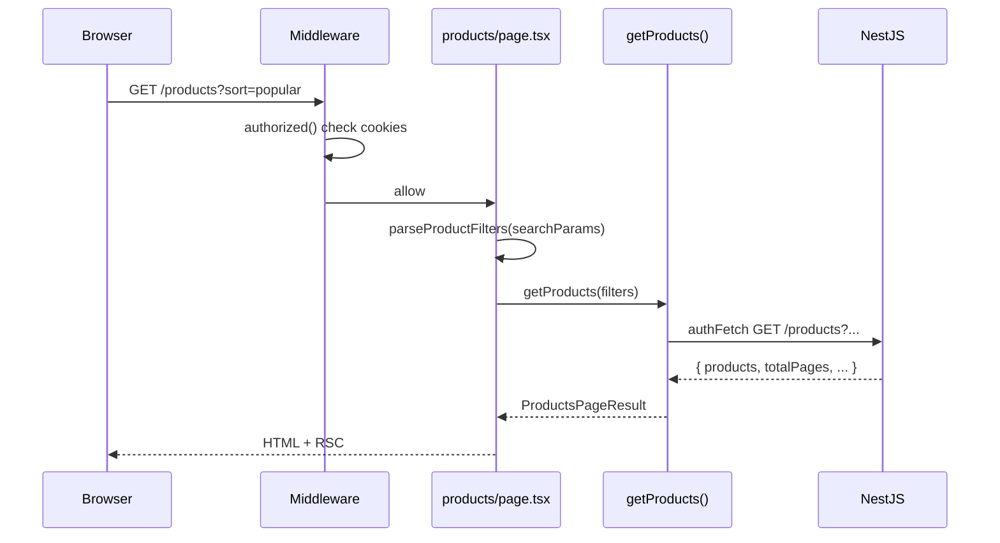

# 10. Ví dụ thực tế — Nova Shop

Map kiến thức Next.js + Auth vào codebase `Nova-online-shopping`.

---

## 10.1 Tech stack

| Layer | Công nghệ |
|-------|-----------|
| Frontend | Next.js (App Router), React, TypeScript |
| Styling | Tailwind CSS, Heroicons, clsx |
| Auth | NextAuth v5 + JWT cookies (NestJS) |
| Payments | Stripe Checkout + Webhooks |
| Backend (external) | NestJS REST API |

Env chính: `NEXT_PUBLIC_EXTERNAL_API_URL`, `AUTH_SECRET`, `STRIPE_*`, `GOOGLE_*`.

---

## 10.2 Cấu trúc thư mục `app/`

```text
app/
├── layout.tsx                 # Root: fonts, metadata, Providers
├── page.tsx                   # Landing
├── (shop)/layout.tsx          # ShopShell
├── (dashboard)/
│   ├── layout.tsx             # ShopShell (catalog đã đăng nhập)
│   ├── products/
│   │   ├── page.tsx           # List + filters + pagination
│   │   ├── search.tsx
│   │   └── [slug]/
│   │       ├── page.tsx
│   │       ├── productForm.tsx    # CLIENT — add to cart
│   │       └── slideImage.tsx
│   ├── cart/page.tsx
│   └── customers/page.tsx
├── login/page.tsx
├── checkout/
│   ├── success/page.tsx
│   └── cancel/page.tsx
├── api/
│   ├── auth/[...nextauth]/route.ts
│   ├── checkout/route.ts
│   ├── checkout/cart/route.ts
│   └── stripe/webhook/route.ts
└── lib/
    ├── services/products.ts   # SERVER — getProducts
    ├── services/cart.ts       # SERVER — cart CRUD
    ├── api-client.ts          # authFetch
    ├── auth-tokens.ts         # cookies + refresh
    ├── actions.ts             # authenticate, googleLogin
    ├── product-filters.ts     # URL params parsing
    └── checkout-sessions.ts   # Stripe
```

Root project:

```text
auth.ts, auth.config.ts, middleware.ts, next.config.ts
```

---

## 10.3 Luồng: Xem danh sách sản phẩm



**File đọc theo thứ tự:**

1. `middleware.ts`
2. `auth.config.ts` → `authorized`
3. `app/(dashboard)/products/page.tsx`
4. `app/lib/product-filters.ts`
5. `app/lib/services/products.ts`
6. `app/lib/api-client.ts`

---

## 10.4 Luồng: Đăng nhập email/password

1. `app/ui/login-form.tsx` (client) → `action={authenticate}`
2. `app/lib/actions.ts` → `signIn("credentials", ...)`
3. `auth.ts` → `Credentials.authorize` → `POST /login`
4. `setAuthCookies` → redirect `/products`
5. Lần sau: middleware thấy cookies hợp lệ

---

## 10.5 Luồng: Google OAuth

1. `google-login-button.tsx` → `signIn("google")`
2. Google callback → `signIn` callback trong `auth.ts`
3. `googleAuthAction` → `POST /google` với `idToken`
4. `setAuthCookies`

---

## 10.6 Luồng: Thêm giỏ hàng

1. `productForm.tsx` (client) gọi `addToCart` Server Action
2. `app/lib/services/cart.ts` → `authFetch POST /cart/add`
3. `revalidatePath("/cart")`, `revalidatePath("/products", "layout")`
4. `syncCartBadge` (client event + localStorage)

---

## 10.7 Luồng: Thanh toán

### Buy Now (một sản phẩm)

1. `BuyNowButton.tsx` → `POST /api/checkout`
2. `createProductCheckoutSession` (Stripe)
3. Redirect `session.url`

### Checkout giỏ

1. `POST /api/checkout/cart`
2. `getCartSummary()` → map items → `createCartCheckoutSession`

### Webhook

1. Stripe `POST /api/stripe/webhook`
2. `constructEvent` → `checkout.session.completed`
3. `handleSuccessfulPayment` (hiện log — có thể mở rộng ghi DB)

---

## 10.8 UI components theo loại

| Server (mặc định) | Client (`"use client"`) |
|-------------------|-------------------------|
| `products/page.tsx` | `login-form.tsx` |
| `listProductsComponent` (nếu không hook) | `productForm.tsx` |
| | `BuyNowButton.tsx` |
| | `navbar.tsx`, `cart-view.tsx` |
| | `product-toolbar.tsx`, `search.tsx` |
| `providers.tsx` bọc SessionProvider | |

---

## 10.9 Types quan trọng

`app/lib/definitions.ts`:

- `ProductListItem`, `ProductsPageResult`
- `Cart`, `CartItem`, `CartSummary`
- `ApiUserInfo`

---

## 10.10 Bài tập thực hành

1. **Thêm route protected `/orders`** — sửa `authorized` + tạo `page.tsx` gọi API giả.
2. **Trace refresh token** — xóa `access_token` cookie, giữ `refresh_token`, reload `/products`, xem network.
3. **Thêm filter mới** — ví dụ `brand` trong URL → `parseProductFilters` → `getProducts` params.
4. **Stripe test** — dùng card `4242...`, xem webhook log terminal.

---

## 10.11 Ghi chú / hạn chế hiện tại

- Backend NestJS **không** nằm trong repo — cần chạy riêng.
- Webhook chưa đồng bộ đơn hàng về DB (placeholder `console.log`).
- README đề cập dashboard analytics — có thể chưa implement đầy đủ.
- Một số type (`Invoice`, `Customer`) từ template Next.js Learn cũ.

---

## 10.12 Liên kết tài liệu trong folder

| Chủ đề | File |
|--------|------|
| Routing | [1. App Router - Chi tiet.md](./1.%20App%20Router%20-%20Chi%20tiet.md) |
| RSC / Client | [2. Server va Client Components.md](./2.%20Server%20va%20Client%20Components.md) |
| Cart / mutations | [3. Server Actions.md](./3.%20Server%20Actions.md) |
| Stripe API | [4. Route Handlers.md](./4.%20Route%20Handlers.md) |
| authFetch | [5. Data Fetching va Cache.md](./5.%20Data%20Fetching%20va%20Cache.md) |
| Route guard | [6. Middleware.md](./6.%20Middleware.md) |
| Auth nền | [7. Authentication - Tong quan.md](./7.%20Authentication%20-%20Tong%20quan.md) |
| NextAuth | [8. NextAuth v5.md](./8.%20NextAuth%20v5.md) |
| JWT dual | [9. JWT Cookies va Dual Auth.md](./9.%20JWT%20Cookies%20va%20Dual%20Auth.md) |
