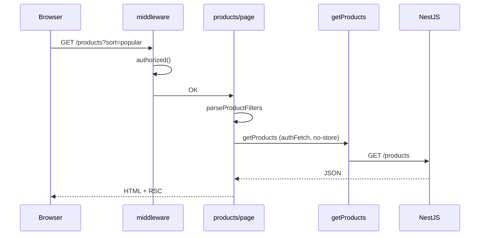

# 10. Nova Shop — Hướng dẫn đọc codebase end-to-end

Tài liệu **ghép mọi chủ đề** (routing, RSC, actions, API, cache, auth) thành **lộ trình đọc code** thực tế `Nova-online-shopping`.

**Đọc sau:** file 1–9. Dùng như “bản đồ” khi onboarding dự án.

---

## Mục lục

1. [Tech stack & env](#1-tech-stack--env)
2. [Cây thư mục `app/`](#2-cây-thư-mục-app)
3. [Lộ trình đọc code (4 ngày gợi ý)](#3-lộ-trình-đọc-code-4-ngày-gợi-ý)
4. [Luồng 1: Xem catalog](#4-luồng-1-xem-catalog)
5. [Luồng 2: Đăng nhập](#5-luồng-2-đăng-nhập)
6. [Luồng 3: Thêm giỏ & cache](#6-luồng-3-thêm-giỏ--cache)
7. [Luồng 4: Thanh toán Stripe](#7-luồng-4-thanh-toán-stripe)
8. [Server vs Client — bảng file](#8-server-vs-client--bảng-file)
9. [Đối chiếu docs vs code (gap)](#9-đối-chiếu-docs-vs-code-gap)
10. [Bài tập thực hành](#10-bài-tập-thực-hành)
11. [Chỉ mục tài liệu học](#11-chỉ-mục-tài-liệu-học)

---

## 1. Tech stack & env

| Layer | Công nghệ |
|-------|-----------|
| UI | Next.js App Router, React, TypeScript, Tailwind |
| Auth | NextAuth v5 + JWT HttpOnly (NestJS) |
| Data | Server Components + Server Actions → NestJS REST |
| Payment | Stripe Checkout + Webhook |
| Backend | **Ngoài repo** — `NEXT_PUBLIC_EXTERNAL_API_URL` |

```env
NEXT_PUBLIC_EXTERNAL_API_URL=http://localhost:5000/api
AUTH_SECRET=...
STRIPE_SECRET_KEY=...
STRIPE_WEBHOOK_SECRET=...
GOOGLE_CLIENT_ID=...
NEXT_PUBLIC_APP_URL=http://localhost:3000
```

---

## 2. Cây thư mục `app/`

```text
app/
├── layout.tsx, page.tsx, error.tsx, global-error.tsx
├── providers.tsx
├── (shop)/
│   ├── layout.tsx              → ShopShell
│   ├── products/page.tsx
│   ├── products/[slug]/page.tsx, productForm.tsx
│   ├── cart/page.tsx, cart-view.tsx
│   └── customers/page.tsx
├── login/page.tsx, login-form.tsx
├── checkout/success|cancel/page.tsx
└── api/
    ├── auth/[...nextauth]/route.ts
    ├── checkout/route.ts, checkout/cart/route.ts
    └── stripe/webhook/route.ts

lib/
├── services/     products.ts, cart.ts, user.ts
├── api-client.ts, auth-tokens.ts, auth-constants.ts
├── revalidate-shop.ts, cache-tags.ts
├── actions.ts, product-filters.ts, checkout-sessions.ts
└── definitions.ts

Root: auth.ts, auth.config.ts, middleware.ts
```

---

## 3. Lộ trình đọc code (4 ngày gợi ý)

| Ngày | Đọc file | Học |
|------|----------|-----|
| 1 | `middleware.ts`, `auth.config.ts`, `login/*`, `actions.ts` | Auth gate |
| 2 | `(shop)/products/page.tsx`, `product-filters.ts`, `services/products.ts` | Routing + fetch |
| 3 | `services/cart.ts`, `productForm.tsx`, `revalidate-shop.ts` | Actions + cache |
| 4 | `api/checkout/*`, `checkout-sessions.ts`, `cart-view.tsx` | Stripe |

Mỗi ngày đọc thêm 1 file tài liệu tương ứng (1–5, 7–9).

---

## 4. Luồng 1: Xem catalog



**Đọc theo thứ tự file:**  
`middleware.ts` → `products/page.tsx` → `product-filters.ts` → `services/products.ts` → `api-client.ts`

**Tài liệu:** [1. App Router](./1.%20App%20Router%20-%20Chi%20tiet.md), [5. Data Fetching](./5.%20Data%20Fetching%20va%20Cache.md)

---

## 5. Luồng 2: Đăng nhập

```text
login-form → authenticate() → signIn("credentials")
  → authorize → POST /login
  → setAuthCookies
  → redirect /products
```

**Google:** `Google provider` → `signIn` callback → `googleAuthAction` → `POST /google`

**File:** `auth.ts`, `auth-tokens.ts`, `app/lib/actions.ts`

**Tài liệu:** [8. NextAuth v5](./8.%20NextAuth%20v5.md), [9. JWT Dual Auth](./9.%20JWT%20Cookies%20va%20Dual%20Auth.md)

---

## 6. Luồng 3: Thêm giỏ & cache

```text
productForm (client)
  → addToCart() [Server Action]
  → POST /cart/add
  → revalidateAfterCartChange()  // tag + path + refresh
  → return CartSummary
  → syncCartBadge (localStorage)
```

**File:** `productForm.tsx`, `services/cart.ts`, `revalidate-shop.ts`, `cache-tags.ts`

**Tài liệu:** [3. Server Actions](./3.%20Server%20Actions.md), [5. Data Fetching](./5.%20Data%20Fetching%20va%20Cache.md) mục 8–9

---

## 7. Luồng 4: Thanh toán Stripe

### Buy Now

```text
BuyNowButton → fetch POST /api/checkout
  → createProductCheckoutSession
  → window.location = session.url
```

### Cart checkout

```text
cart-view → fetch POST /api/checkout/cart
  → getCartSummary() → createCartCheckoutSession
```

### Webhook

```text
Stripe → POST /api/stripe/webhook
  → constructEvent(raw body)
  → revalidateAfterCartChange({ refreshRoute: false })
```

**Tài liệu:** [4. Route Handlers](./4.%20Route%20Handlers.md)

---

## 8. Server vs Client — bảng file

| Server (mặc định) | Client (`"use client"`) |
|-------------------|-------------------------|
| `products/page.tsx` | `productForm.tsx` |
| `cart/page.tsx` (wrapper) | `cart-view.tsx` |
| `listProductsComponent` | `product-toolbar.tsx`, `search.tsx` |
| `shop-shell.tsx` (layout) | `navbar.tsx` |
| | `BuyNowButton.tsx`, `login-form.tsx` |
| `providers.tsx` bọc SessionProvider | |

---

## 9. Đối chiếu docs vs code (gap)

| Chủ đề | Docs khuyến nghị | Nova hiện tại | Ghi chú |
|--------|------------------|---------------|---------|
| Catalog cache | ISR public | `no-store` khi authenticated | Members-only shop OK |
| Navbar data | Layout server | Client `getCart` | Cải thiện được |
| Webhook → DB | Ghi đơn NestJS | `console.log` | TODO |
| `userId` query | JWT claims | `?userId=` cookie | Backend |
| `error.tsx` | Per segment | ✅ Đã có | |
| Dual jwt callback | Một file | Trùng auth + auth.config | Refactor |

Chi tiết: [0. Mapping & Best Practices](./0.%20Next.js%20Official%20Docs%20Mapping%20va%20Best%20Practices.md)

---

## 10. Bài tập thực hành

1. Trace cookie sau login — DevTools Application.
2. Xóa `access_token`, giữ `refresh_token`, reload `/products` — quan sát network `/token`.
3. Thêm filter `brand` — `product-filters.ts` → `getProducts` params.
4. Throw error test — `products/error.tsx` UI.
5. Stripe test card `4242 4242 4242 4242` — webhook log.

---

## 11. Chỉ mục tài liệu học

| # | File | Chủ đề |
|---|------|--------|
| 1 | App Router | URL, layout, searchParams |
| 2 | Server vs Client | RSC, composition |
| 3 | Server Actions | mutations |
| 4 | Route Handlers | Stripe, webhook |
| 5 | Data Fetching | cache, tag, refresh |
| 6 | Middleware | authorized |
| 7–9 | Auth | NextAuth + JWT |
| 0 | Mapping | Docs chính thức vs Nova |

**Home:** [README.md](./README.md)
