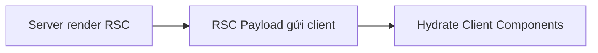

# 2. Server vs Client Components — Hướng dẫn chi tiết

Tài liệu giải thích **hai loại component** trong App Router, **khi nào dùng loại nào**, và **cách Nova Shop** tách `products/page.tsx` (server) vs `productForm` (client).

**Đọc theo thứ tự:** Mục 1 → 2 (bảng so sánh) → 3–5 (composition, props) → 6 (Nova) → 7 (FAQ).

**Docs chính thức:** [Server and Client Components](https://nextjs.org/docs/app/getting-started/server-and-client-components)

---

## Mục lục

1. [Vấn đề: SPA vs RSC](#1-vấn-đề-spa-vs-rsc)
2. [Hai loại component — bảng so sánh](#2-hai-loại-component--bảng-so-sánh)
3. [Server Component chạy thế nào?](#3-server-component-chạy-thế-nào)
4. [Client Component — khi nào bắt buộc](#4-client-component--khi-nào-bắt-buộc)
5. [Composition: server cha, client lá](#5-composition-server-cha-client-lá)
6. [Truyền props & Server Actions](#6-truyền-props--server-actions)
7. [Suspense, streaming, `loading.tsx`](#7-suspense-streaming-loadingtsx)
8. [Nova Shop — map file thực tế](#8-nova-shop--map-file-thực-tế)
9. [FAQ & lỗi thường gặp](#9-faq--lỗi-thường-gặp)
10. [Bản đồ file](#10-bản-đồ-file)

---

## 1. Vấn đề: SPA vs RSC

**React SPA thuần:**

```text
Browser tải bundle lớn → useEffect fetch API → render
```

- Secret/API key dễ lộ nếu fetch từ client.
- SEO: crawler thấy skeleton trước khi JS chạy.
- Waterfall: layout fetch → child fetch → chậm.

**Next.js Server Components (RSC):**

```text
Server fetch + render HTML/RSC payload → browser hydrate phần client nhỏ
```

→ Nova Shop mặc định **server fetch** (`getProducts` trong `page.tsx`).

---

## 2. Hai loại component — bảng so sánh

| | Server (mặc định) | Client (`"use client"`) |
|---|-------------------|-------------------------|
| Khai báo | Không cần directive | `"use client"` đầu file |
| Chạy ở | Chỉ server | Server (SSR lần đầu) + browser |
| JS gửi client | Không (phần lớn) | Có — bundle tăng |
| `useState`, `useEffect` | ❌ | ✅ |
| `onClick`, `onChange` | ❌ | ✅ |
| `async function Page()` | ✅ | ❌ |
| Đọc `process.env` secret | ✅ | ❌ (chỉ `NEXT_PUBLIC_`) |
| Import Client | ✅ | ✅ |
| Import Server vào Client | ❌ | ❌ |

**Quy tắc nhớ:** File trong `app/` **mặc định là Server** trừ khi có `"use client"`.

---

## 3. Server Component chạy thế nào?



- Server Component **không** thành bundle React chạy lại trên browser.
- Output là **RSC payload** — client hiểu cấu trúc + data đã serialize.
- Client Component được **reference** và hydrate (gắn event).

**Nova ví dụ:**

```tsx
// app/(shop)/products/page.tsx — SERVER
export default async function ProductsPage(props) {
  const result = await getProducts({ ...filters }); // chạy trên server
  return (
    <>
      <ListProductsComponent products={result.products} />
      <Suspense fallback={null}>
        <ProductToolbar />  {/* CLIENT */}
      </Suspense>
    </>
  );
}
```

---

## 4. Client Component — khi nào bắt buộc

| Cần | Nova Shop file |
|-----|----------------|
| `useState` / `useTransition` | `cart-view.tsx`, `productForm.tsx` |
| `useRouter`, `useSearchParams` | `product-toolbar.tsx`, `navbar.tsx` |
| `onClick`, form events | `BuyNowButton.tsx`, `login-form.tsx` |
| `localStorage`, `window` | `cart-events.ts`, `navbar.tsx` |
| `useSession` (NextAuth) | `navbar.tsx` |
| Thư viện chỉ hỗ trợ client | Một số chart/map |

**Anti-pattern:** Đặt `"use client"` ở `page.tsx` chỉ vì một nút → **cả trang** thành client, mất lợi RSC.

---

## 5. Composition: server cha, client lá

### Pattern khuyến nghị (docs)

```text
Page (Server) — fetch data
  ├── List (Server hoặc Server) — hiển thị
  └── Toolbar (Client) — tương tác URL/filter
```

### Pattern nâng cao: client wrapper, server children

```tsx
"use client";
export function ClientShell({ children }: { children: React.ReactNode }) {
  const [open, setOpen] = useState(false);
  return <div>{children}</div>;  // children vẫn có thể là Server Components
}
```

```tsx
// page.tsx — server
<ClientShell>
  <ServerProductList />  {/* vẫn server */}
</ClientShell>
```

**Lưu ý:** Không import trực tiếp Server Component **vào** file client — chỉ qua `children` slot.

---

## 6. Truyền props & Server Actions

### Props Server → Client

Chỉ **serializable** (JSON-safe):

```tsx
// ✅
<BuyNowButton product={{ id: "1", name: "Phone", price: 999 }} />

// ❌ function, class instance, Date không serialize được
<Child onLoad={() => fetch()} />
```

### Server Actions — ngoại lệ

Client có thể `import { addToCart } from "@/app/lib/services/cart"` — Next.js tạo POST endpoint nội bộ. Xem [3. Server Actions](./3.%20Server%20Actions.md).

---

## 7. Suspense, streaming, `loading.tsx`

```tsx
<Suspense fallback={<Skeleton />}>
  <ProductToolbar />  {/* client, dùng useSearchParams */}
</Suspense>
```

| Cơ chế | Tác dụng |
|--------|----------|
| `<Suspense>` | Stream phần chậm sau phần nhanh |
| `loading.tsx` | Suspense boundary tự động cho **segment** |

Nova: `ProductToolbar` + `ProductPagination` trong Suspense vì `useSearchParams` cần boundary (Next.js yêu cầu).

---

## 8. Nova Shop — map file thực tế

| File | Loại | Lý do |
|------|------|-------|
| `(shop)/products/page.tsx` | Server | `async` + `getProducts` |
| `listProductsComponent.tsx` | Server* | Chỉ render props, không hook |
| `product-toolbar.tsx` | Client | `useRouter`, đổi URL filter |
| `productForm.tsx` | Client | `addToCart`, state qty |
| `navbar.tsx` | Client | `useSession`, scroll, cart badge |
| `providers.tsx` | Client | `SessionProvider` |
| `shop-shell.tsx` | Server | Bọc Suspense + navbar client |

\*Nếu sau này thêm hook → phải chuyển client.

### Điểm cải thiện (so best practice)

`navbar.tsx` gọi `getCart()`, `getUser()` từ client → thêm round-trip.

**Hướng tốt hơn:**

```tsx
// (shop)/layout.tsx — server async
const cartCount = (await getCartSummary()).totalItems;
return <ShopShell cartCount={cartCount}>{children}</ShopShell>;
```

---

## 9. FAQ & lỗi thường gặp

### FAQ

**Q: Server Component có chạy lại trên mỗi request?**  
Trong dynamic route (cookie, `no-store` fetch) — **có**, mỗi request render mới.

**Q: `"use client"` ở đầu file con có làm cha thành client?**  
Không — chỉ file đó và **import tree phía dưới** trong file đó.

**Q: Context API?**  
Provider phải ở client (`SessionProvider`). Server children bọc bởi provider vẫn OK.

### Lỗi thường gặp

| Lỗi | Nguyên nhân | Cách sửa |
|-----|-------------|----------|
| needs `useState` | Hook trong server file | Tách client file |
| Hydration mismatch | `Date.now()` / random id khi render | Chỉ random ở client `useEffect` |
| Secret lộ | `NEXT_PUBLIC_STRIPE_SECRET` | Bỏ prefix PUBLIC |

---

## 10. Bản đồ file

```text
app/(shop)/products/page.tsx     → Server, entry
app/ui/products/product-toolbar.tsx → Client
app/(dashboard)/products/[slug]/productForm.tsx → Client (nếu còn path)
app/providers.tsx                → Client, root
```

**Tiếp theo:** [3. Server Actions](./3.%20Server%20Actions.md) · [5. Data Fetching](./5.%20Data%20Fetching%20va%20Cache.md)
