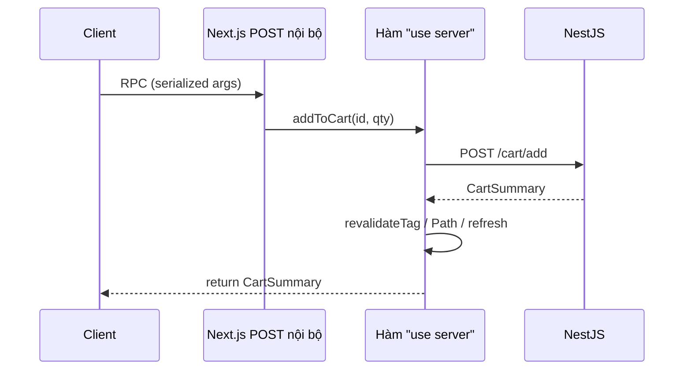
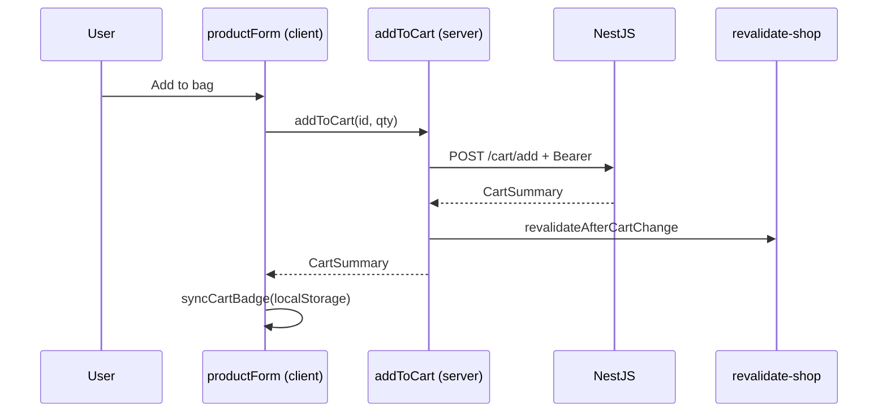

# 3. Server Actions — Hướng dẫn chi tiết

Tài liệu giải thích **Server Functions / Server Actions** — gọi hàm server từ form hoặc client **không cần** tự viết `/api/...` cho mọi mutation.

**Đọc theo thứ tự:** Mục 1 → 2 (khai báo) → 3–4 (form vs client) → 5 (revalidate) → 6 (Nova flow) → 7 (FAQ).

**Docs:** [Mutating Data](https://nextjs.org/docs/app/getting-started/mutating-data) · [serverActions config](https://nextjs.org/docs/app/api-reference/config/next-config-js/serverActions)

---

## Mục lục

1. [Vấn đề Server Actions giải quyết](#1-vấn-đề-server-actions-giải-quyết)
2. [Server Action là gì — mental model](#2-server-action-là-gì--mental-model)
3. [Khai báo `"use server"`](#3-khai-báo-use-server)
4. [Gọi từ Form — progressive enhancement](#4-gọi-từ-form--progressive-enhancement)
5. [Gọi từ Client Component](#5-gọi-từ-client-component)
6. [Server Action vs Route Handler](#6-server-action-vs-route-handler)
7. [Sau mutation: revalidate & refresh](#7-sau-mutation-revalidate--refresh)
8. [Bảo mật — coi như public API](#8-bảo-mật--coi-như-public-api)
9. [Luồng Nova: thêm giỏ hàng](#9-luồng-nova-thêm-giỏ-hàng)
10. [FAQ & bản đồ file](#10-faq--bản-đồ-file)

---

## 1. Vấn đề Server Actions giải quyết

**Cách cũ (SPA / Pages API):**

```text
Client onClick → fetch POST /api/cart/add → JSON → setState
```

Phải: viết Route Handler, validate, CORS, duplicate types.

**Server Actions:**

```text
Client onClick → await addToCart()  // hàm server, Next.js lo transport
```

→ Nova: `app/lib/services/cart.ts` — `addToCart`, `updateCartItem`, …

---

## 2. Server Action là gì — mental model



| Đặc điểm | Chi tiết |
|----------|----------|
| HTTP method | Chỉ **POST** (Next.js quy ước) |
| Endpoint | Tự sinh, ID khó đoán (v15+) |
| Vị trí chạy | Luôn **server** |
| Return | Phải serializable |

---

## 3. Khai báo `"use server"`

### Cả file

```ts
// app/lib/services/cart.ts
"use server";

export async function addToCart(productId: string, quantity: number) {
  // ...
}
```

### Một hàm trong file client (ít dùng)

```tsx
"use client";
async function submit() {
  "use server";
  // ...
}
```

Nova: **cả file** `services/cart.ts`, `actions.ts`.

---

## 4. Gọi từ Form — progressive enhancement

```tsx
// login-form.tsx
import { authenticate } from "@/app/lib/actions";

<form action={authenticate}>
  <input name="email" type="email" />
  <input name="password" type="password" />
  <button type="submit">Sign in</button>
</form>
```

```ts
// actions.ts
"use server";
export async function authenticate(prevState: string | undefined, formData: FormData) {
  await signIn("credentials", {
    email: formData.get("email"),
    password: formData.get("password"),
    redirectTo: "/products",
  });
}
```

**`useActionState` (React 19):** hiển thị lỗi + `isPending`:

```tsx
const [state, formAction, isPending] = useActionState(authenticate, undefined);
```

**Lưu ý:** `signIn` thành công thường **throw redirect** — catch `AuthError`, rethrow redirect.

---

## 5. Gọi từ Client Component

```tsx
"use client";
import { addToCart } from "@/app/lib/services/cart";
import { syncCartBadge } from "@/app/lib/cart-events";

startTransition(async () => {
  const summary = await addToCart(productId, qty, color, storage);
  syncCartBadge(summary.totalItems);
});
```

| Bước | Việc xảy ra |
|------|-------------|
| 1 | Client serialize arguments |
| 2 | POST tới Next.js action endpoint |
| 3 | Server chạy `addToCart` |
| 4 | Trả `CartSummary` về client |

**Không** dùng action cho **read nặng lặp lại** (navbar gọi `getCart` mỗi mount) — fetch trên layout server thay thế.

---

## 6. Server Action vs Route Handler

| Tiêu chí | Server Action | Route Handler `route.ts` |
|----------|---------------|---------------------------|
| URL cố định | Không (endpoint nội bộ) | `/api/checkout` |
| Caller | Form, `await action()` | `fetch`, Stripe, Postman |
| Webhook Stripe | ❌ | ✅ |
| Mobile app REST | Khó | ✅ |
| Type-safe từ app | ✅ tốt | Trung bình |

**Nova phân chia:**

| Việc | Công nghệ |
|------|-----------|
| Cart CRUD | Server Actions `cart.ts` |
| Stripe checkout URL | `POST /api/checkout` |
| Stripe webhook | `POST /api/stripe/webhook` |

---

## 7. Sau mutation: revalidate & refresh

Chi tiết đầy đủ: **[5. Data Fetching va Cache](./5.%20Data%20Fetching%20va%20Cache.md)**.

**Tóm tắt trong Nova** — `revalidateAfterCartChange()`:

```ts
revalidateTag("products");   // Data Cache catalog
revalidatePath("/cart");      // Route RSC
revalidatePath("/products", "layout");
refresh();                    // Route hiện tại
```

| API | Khi nào |
|-----|---------|
| `revalidateTag` | Fetch có gắn tag (catalog ISR) |
| `revalidatePath` | Buộc page/layout render lại |
| `refresh()` | Soft-refresh route đang xem |

**Client gọi refresh thủ công:**

```ts
// actions.ts
export async function refreshShopData() {
  refreshShopRoute();
}
```

---

## 8. Bảo mật — coi như public API

Next.js 15: Action ID unguessable, dead code elimination — **nhưng vẫn là HTTP POST công khai**.

**Bắt buộc trong mỗi action:**

1. `authFetch` / kiểm tra session.
2. Validate input (Zod).
3. Không tin `userId` từ client nếu lấy được từ cookie/server.

```ts
// ❌ Tin body client
await fetch(`/cart?userId=${body.userId}`);

// ✅ Cookie / token server-side
const userId = cookies().get("user_id")?.value;
```

**Production:** `serverActions.allowedOrigins` trong `next.config.ts` nếu sau reverse proxy.

---

## 9. Luồng Nova: thêm giỏ hàng



**File:** `productForm.tsx` → `services/cart.ts` → `revalidate-shop.ts`

---

## 10. FAQ & bản đồ file

### FAQ

**Q: Action có chạy trên Edge?**  
Tùy runtime route; logic Stripe/cart dùng Node APIs → thường Node runtime.

**Q: `redirect()` trong action?**  
Throw nội bộ — đừng catch nuốt mất.

**Q: Khi nào KHÔNG dùng Action?**  
Webhook, public REST, upload progress stream → Route Handler.

### Bài tập

1. Vì sao webhook Stripe không dùng Server Action? → Cần URL cố định, raw body, caller bên ngoài.
2. Sau `addToCart`, tại sao gọi cả `revalidateTag` lẫn `refresh()`? → Xem file 5 mục 8.

### Bản đồ file

```text
app/lib/services/cart.ts      → mutations + getCartSummary
app/lib/actions.ts            → authenticate, refreshShopData
app/lib/revalidate-shop.ts    → revalidate helpers
app/ui/.../productForm.tsx    → gọi addToCart
```

**Tiếp theo:** [4. Route Handlers](./4.%20Route%20Handlers.md) · [5. Data Fetching](./5.%20Data%20Fetching%20va%20Cache.md)
