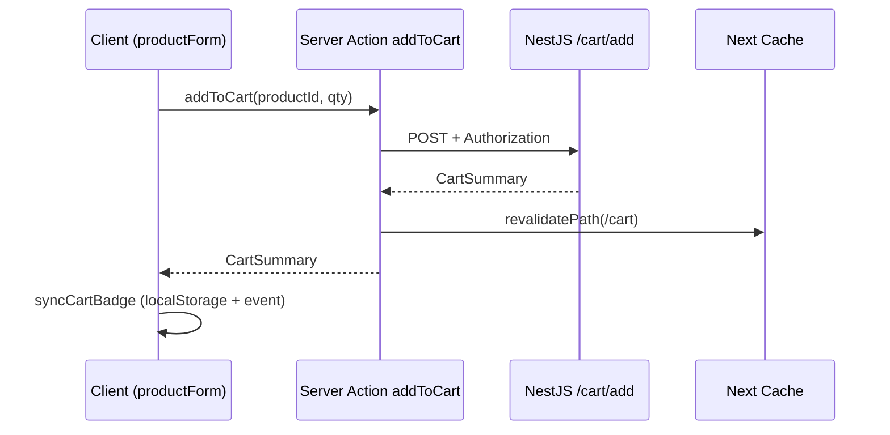

# 3. Server Actions

Server Actions là hàm **chạy trên server**, gọi từ form hoặc client qua RPC-like protocol của Next.js.

---

## 3.1 Khai báo

```ts
"use server";

export async function addToCart(productId: string, quantity: number) {
  const res = await authFetch(`${apiUrl}/cart/add`, { method: "POST", ... });
  revalidatePath("/cart");
  return await res.json();
}
```

- Directive `"use server"` ở **đầu file** hoặc **đầu hàm** (trong file client).
- File trong `app/lib/services/cart.ts` — pattern Nova Shop.

---

## 3.2 Gọi từ Form (không cần API route riêng)

```tsx
// login-form.tsx (client) gọi action từ actions.ts
import { authenticate } from "@/app/lib/actions";

<form action={authenticate}>
  <input name="email" />
  <input name="password" type="password" />
  <button type="submit">Login</button>
</form>
```

```ts
// actions.ts
"use server";
export async function authenticate(prevState, formData: FormData) {
  await signIn("credentials", {
    email: formData.get("email"),
    password: formData.get("password"),
    redirectTo: "/products",
  });
}
```

**`useFormState`** — hiển thị lỗi validation từ action trả về string.

---

## 3.3 Gọi từ Client Component

```tsx
"use client";
import { addToCart } from "@/app/lib/services/cart";

async function handleAdd() {
  const summary = await addToCart(id, qty, color, storage);
  syncCartBadge(summary.totalItems);
}
```

Next.js serialize request → chạy hàm trên server → trả kết quả.

---

## 3.4 So sánh Server Action vs Route Handler

| | Server Action | Route Handler (`route.ts`) |
|---|---------------|----------------------------|
| Gọi từ | Form, client function | `fetch('/api/...')`, webhook bên ngoài |
| URL công khai | Không (endpoint nội bộ) | Có `/api/checkout` |
| Webhook Stripe | ❌ | ✅ |
| REST cho mobile app | Khó | ✅ |

**Nova Shop:**

- Cart CRUD → Server Actions (`cart.ts`)
- Stripe checkout → Route Handler (`api/checkout/route.ts`) vì client `fetch` + webhook cần URL cố định

---

## 3.5 Cache và revalidation

Sau mutation, cập nhật UI đã cache:

```ts
import { revalidatePath } from "next/cache";

revalidatePath("/cart");
revalidatePath("/products", "layout"); // cả layout con
```

Không revalidate → user thấy data cũ cho đến khi hard refresh.

---

## 3.6 Navigation helpers

```ts
import { unauthorized, redirect, notFound } from "next/navigation";

if (res.status === 401) unauthorized(); // trigger auth flow
redirect("/login");
notFound();
```

**Lưu ý:** `redirect` / `unauthorized` **throw** internally — bọc try/catch cẩn thận (Nova Shop dùng `isNextNavigationError`).

---

## 3.7 Bảo mật

Server Actions **không thay thế auth**:

- Luôn kiểm tra session/token trên server.
- `authFetch` gắn Bearer token từ cookie.
- Không tin `userId` từ client body nếu có thể lấy từ session server-side.

---

## 3.8 Luồng thêm giỏ hàng (Nova Shop)



---

## 3.9 Best practices

1. Đặt business logic gọi API trong `app/lib/services/`, không rải rác trong UI.
2. Một action một trách nhiệm (`updateCartItem`, `removeFromCart`).
3. Trả type rõ (`CartSummary`) để client cập nhật UI.
4. Log lỗi server; message user-friendly ở UI.

---

## 3.10 Khi KHÔNG dùng Server Action

- Webhook bên thứ ba (Stripe gọi POST `/api/stripe/webhook`).
- Public REST API cho app khác.
- Upload file lớn với progress (cân nhắc Route Handler + streaming).
