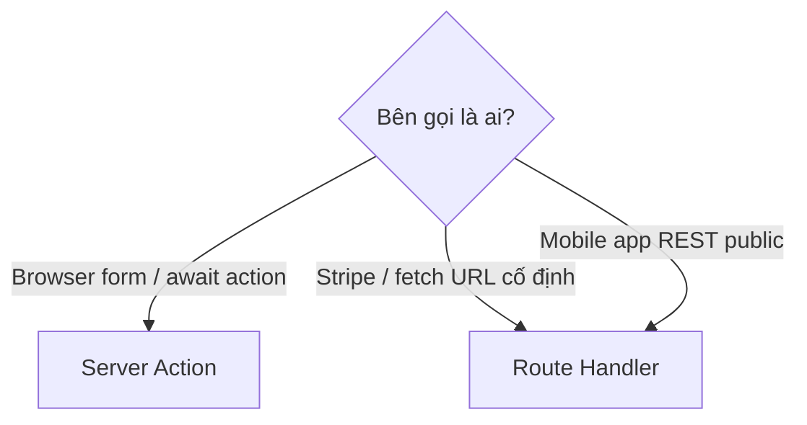

# 4. Route Handlers — Hướng dẫn chi tiết

Tài liệu giải thích **`app/api/**/route.ts`** — tạo API HTTP trong Next.js (checkout Stripe, webhook, NextAuth).

**Đọc theo thứ tự:** Mục 1 → 2 (cú pháp) → 3 (khi nào dùng) → 4–6 (Nova Stripe) → 7 (FAQ).

**Docs:** [Route Handlers](https://nextjs.org/docs/app/api-reference/file-conventions/route) · [Route Handlers getting started](https://nextjs.org/docs/app/getting-started/route-handlers-and-middleware)

---

## Mục lục

1. [Route Handler là gì?](#1-route-handler-là-gì)
2. [Cú pháp cơ bản](#2-cú-pháp-cơ-bản)
3. [Đọc request & trả response](#3-đọc-request--trả-response)
4. [Dynamic routes & NextAuth catch-all](#4-dynamic-routes--nextauth-catch-all)
5. [Khi dùng Route Handler vs Server Action](#5-khi-dùng-route-handler-vs-server-action)
6. [Nova Shop — ba endpoint chính](#6-nova-shop--ba-endpoint-chính)
7. [Webhook Stripe — raw body](#7-webhook-stripe--raw-body)
8. [Auth, middleware, CORS](#8-auth-middleware-cors)
9. [Next.js 15 — GET mặc định dynamic](#9-nextjs-15--get-mặc-định-dynamic)
10. [FAQ & bản đồ file](#10-faq--bản-đồ-file)

---

## 1. Route Handler là gì?

```text
pages/api/hello.ts   (cũ — Pages Router)
        ↓
app/api/hello/route.ts   (App Router — Route Handler)
```

| | Page (`page.tsx`) | Route Handler (`route.ts`) |
|---|-------------------|----------------------------|
| Output | HTML / RSC UI | JSON, text, stream |
| Navigate bằng `<Link>` | ✅ | ❌ |
| Gọi bằng `fetch` | Có thể | ✅ chính |

**Không** đặt `page.tsx` và `route.ts` **cùng folder** — Nova tách `app/api/*` riêng.

---

## 2. Cú pháp cơ bản

```ts
// app/api/checkout/route.ts
import { NextRequest, NextResponse } from "next/server";

export async function POST(request: NextRequest) {
  const body = await request.json();
  return NextResponse.json({ sessionId: "...", url: "..." });
}
```

| Export function | HTTP method |
|-----------------|-------------|
| `GET` | GET |
| `POST` | POST |
| `PUT`, `PATCH`, `DELETE` | tương ứng |
| `HEAD`, `OPTIONS` | tương ứng |

Thiếu method → **405 Method Not Allowed**.

---

## 3. Đọc request & trả response

```ts
// JSON body (checkout)
const { productId, price } = await request.json();

// Form
const form = await request.formData();

// Raw text — BẮT BUỘC cho Stripe webhook
const rawBody = await request.text();

// Headers
const sig = request.headers.get("stripe-signature");

// Query
const q = request.nextUrl.searchParams.get("query");

// Response
return NextResponse.json({ ok: true });
return new NextResponse("Forbidden", { status: 403 });
```

---

## 4. Dynamic routes & NextAuth catch-all

```text
app/api/auth/[...nextauth]/route.ts  →  /api/auth/*
```

NextAuth v5:

```ts
import { handlers } from "@/auth";
export const { GET, POST } = handlers;
```

**Next.js 15:** `params` trong handler là `Promise` — `const { team } = await params`.

---

## 5. Khi dùng Route Handler vs Server Action



| Scenario | Chọn |
|----------|------|
| Thêm giỏ, update qty | Server Action |
| Buy Now → Stripe URL | Route Handler `POST /api/checkout` |
| Stripe webhook | Route Handler `POST /api/stripe/webhook` |
| NextAuth OAuth callback | Route Handler `[...nextauth]` |

---

## 6. Nova Shop — ba endpoint chính

### 6.1 Buy Now — `POST /api/checkout`

```text
Client BuyNowButton
  → fetch("/api/checkout", { body: { productId, price, quantity } })
  → createProductCheckoutSession()
  → { url } → window.location.href = url (Stripe Hosted)
```

**File:** `app/api/checkout/route.ts` → `checkout-sessions.ts`

### 6.2 Checkout giỏ — `POST /api/checkout/cart`

```text
cart-view handleCheckout
  → fetch("/api/checkout/cart")
  → getCartSummary() trên server
  → createCartCheckoutSession(items)
  → redirect Stripe
```

**File:** `app/api/checkout/cart/route.ts`

### 6.3 Webhook — `POST /api/stripe/webhook`

```text
Stripe servers
  → POST /api/stripe/webhook
  → handleStripeWebhook()
  → constructEvent(rawBody, signature)
  → revalidateAfterCartChange (refreshRoute: false)
```

**File:** `app/api/stripe/webhook/route.ts`

---

## 7. Webhook Stripe — raw body

**Sai — phá chữ ký:**

```ts
const body = await request.json();  // ❌
stripe.webhooks.constructEvent(body, ...);
```

**Đúng — Nova Shop:**

```ts
const body = await request.text();
const event = stripe.webhooks.constructEvent(
  body,
  signature,
  process.env.STRIPE_WEBHOOK_SECRET!,
);
```

| Lý do | |
|-------|---|
| Stripe ký **raw bytes** | `json()` đổi format → verify fail |

Sau `checkout.session.completed` → `revalidateProductsCatalog` + `revalidateAfterCartChange` (chưa ghi DB NestJS — TODO).

---

## 8. Auth, middleware, CORS

### Middleware thường **exclude** `/api`

```ts
// middleware.ts matcher
"/((?!api|_next/static|...).*)"
```

→ `/api/checkout` **không** qua `authorized` — cần auth trong handler nếu cần:

```ts
import { auth } from "@/auth";
const session = await auth();
if (!session) return NextResponse.json({ error: "Unauthorized" }, { status: 401 });
```

Cart checkout: `getCartSummary()` dùng cookie server — implicit auth.

### CORS

Nova: business API ở NestJS; Route Handler Next cho Stripe. Nếu expose public API:

```ts
return NextResponse.json(data, {
  headers: { "Access-Control-Allow-Origin": "https://allowed.com" },
});
```

---

## 9. Next.js 15 — GET mặc định dynamic

Trước v15: GET Route Handler có thể cache static.  
**v15: GET mặc định dynamic.**

Muốn cache GET:

```ts
export const dynamic = "force-static";
export const revalidate = 60;
```

Nova checkout chỉ **POST** — không ảnh hưởng.

**Runtime:** Stripe SDK cần Node — có thể thêm `export const runtime = "nodejs"`.

---

## 10. FAQ & bản đồ file

### FAQ

**Q: Route Handler có qua `ShopShell` layout không?**  
Không — chỉ trả data, không UI.

**Q: Validate input?**  
Luôn — 400 nếu thiếu field (`productId`, `price`).

**Q: Log secret trong handler?**  
Không log `STRIPE_SECRET_KEY`, webhook secret.

### Checklist Route Handler mới

1. Method đúng (POST mutation).
2. Validate body.
3. Webhook: `text()` + verify signature.
4. Env missing → 500 message rõ.
5. Side effects → `revalidateTag` / gọi NestJS.

### Bản đồ file

```text
app/api/checkout/route.ts
app/api/checkout/cart/route.ts
app/api/stripe/webhook/route.ts
app/api/auth/[...nextauth]/route.ts
app/lib/checkout-sessions.ts    → logic Stripe + webhook handler
```

**Tiếp theo:** [5. Data Fetching](./5.%20Data%20Fetching%20va%20Cache.md) · [3. Server Actions](./3.%20Server%20Actions.md)
