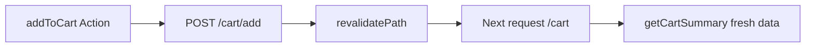

# 5. Data Fetching, Cache & Revalidation

Next.js mở rộng `fetch` với caching và revalidation — hiểu rõ để tránh data “cũ” hoặc fetch thừa.

---

## 5.1 Fetch trong Server Component

```tsx
export default async function Page() {
  const res = await fetch("https://api.example.com/products", {
    method: "GET",
    headers: await getAuthHeaders(),
    next: { revalidate: 60 }, // ISR: cache 60s
  });
  const data = await res.json();
}
```

| Option | Ý nghĩa |
|--------|---------|
| `cache: 'force-cache'` | Mặc định — cache vĩnh viễn (static) |
| `cache: 'no-store'` | Luôn fetch mới (dynamic) |
| `next: { revalidate: N }` | Cache N giây rồi revalidate background |
| `next: { tags: ['products'] }` | Nhóm cache để `revalidateTag` |

---

## 5.2 authFetch — pattern Nova Shop

Không dùng `fetch` thuần cho API cần đăng nhập:

```ts
// app/lib/api-client.ts
export async function authFetch(url: string, init?: RequestInit) {
  await ensureValidAccessToken();
  let response = await fetch(url, { ...init, headers: await getAuthHeaders() });
  if (response.status === 401) {
    const refreshed = await refreshTokens();
    if (refreshed) {
      response = await fetch(url, { ...init, headers: await getAuthHeaders() });
    }
  }
  return response;
}
```

**Luồng:**

1. Kiểm tra access token hết hạn → refresh qua `/token`.
2. Gắn `Authorization: Bearer ...` + forward cookies nếu cần.
3. Retry một lần sau refresh.

---

## 5.3 Service layer

```text
Page (Server Component)
    → getProducts() / getCartSummary()  [app/lib/services/*.ts]
        → authFetch(backend URL)
```

**Lợi ích:** đổi API một chỗ; page chỉ lo UI.

---

## 5.4 URLSearchParams — query API

```ts
const params = new URLSearchParams();
if (query) params.set("search", query);
params.set("page", String(page));
params.set("limit", "8");

const url = `${apiUrl}/products?${params}`;
```

Khớp contract backend (NestJS): `search`, `sort`, `minPrice`, `onSale`, …

---

## 5.5 revalidatePath & revalidateTag

**Sau mutation (Server Action):**

```ts
revalidatePath("/cart");
revalidatePath("/products", "layout");
```

| Hàm | Khi dùng |
|-----|----------|
| `revalidatePath('/products')` | Invalidate route đó |
| `revalidatePath('/products', 'layout')` | Cả layout + children |
| `revalidateTag('products')` | Invalidate mọi fetch có tag `products` |

Nova Shop: mỗi `addToCart`, `updateCartItem`, … gọi `revalidateCartPaths()`.

---

## 5.6 Public vs authenticated fetch

```ts
// products.ts
const res = authenticated
  ? await authFetch(url)
  : await fetch(url, { next: { revalidate: 60 } });
```

Catalog có thể public cache; dashboard cart bắt buộc auth.

---

## 5.7 Xử lý lỗi HTTP

```ts
if (res.status === 401) unauthorized();
if (res.status === 404) return EMPTY_CART;
if (!res.ok) {
  console.error("Failed:", res.status);
  return EMPTY_RESULT;
}
```

**Phòng thủ:** API down → UI empty state, không crash cả page (trừ trang bắt buộc có data).

---

## 5.7.1 parseProductFilters — single source of truth

```ts
// app/lib/product-filters.ts
export function parseProductFilters(params: ProductFilterParams) {
  const page = Math.max(1, Number(params.page) || 1);
  const sort = SORT_OPTIONS.some(o => o.value === params.sort) ? params.sort : "popular";
  // ...
}
```

Tránh `Number(undefined)` → NaN trên UI.

---

## 5.8 Environment variables

```env
NEXT_PUBLIC_EXTERNAL_API_URL=http://localhost:5000/api
```

- `NEXT_PUBLIC_*` — embed vào bundle client (chỉ URL public).
- Secret backend keys **không** prefix `NEXT_PUBLIC_`.

---

## 5.9 Sơ đồ cache sau thêm giỏ



---

## 5.10 Câu hỏi ôn tập

1. Tại sao cart không dùng `revalidate: 3600` mà dùng `revalidatePath`? → Cart thay đổi theo hành vi user, cần invalidate ngay sau mutation.
2. `authFetch` chạy ở server hay client? → Server (services có `"use server"` hoặc gọi từ Server Component).
