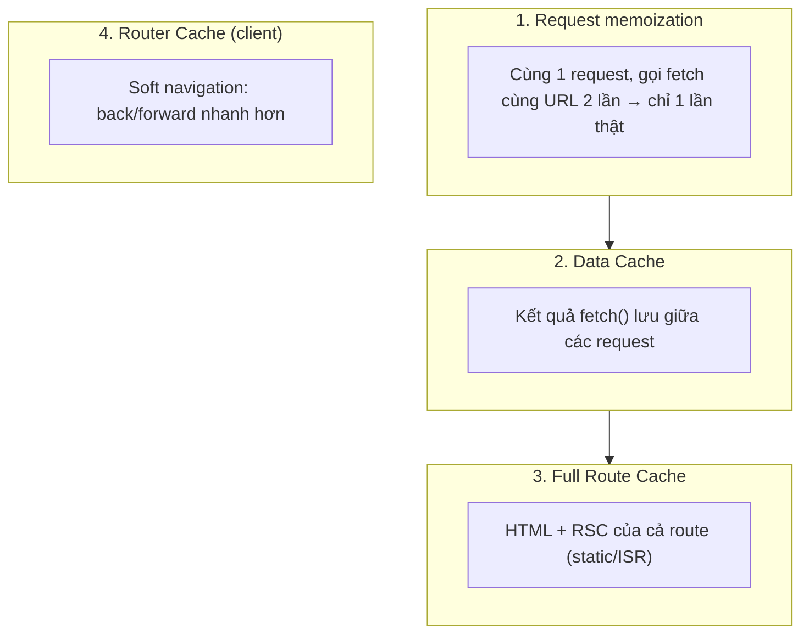
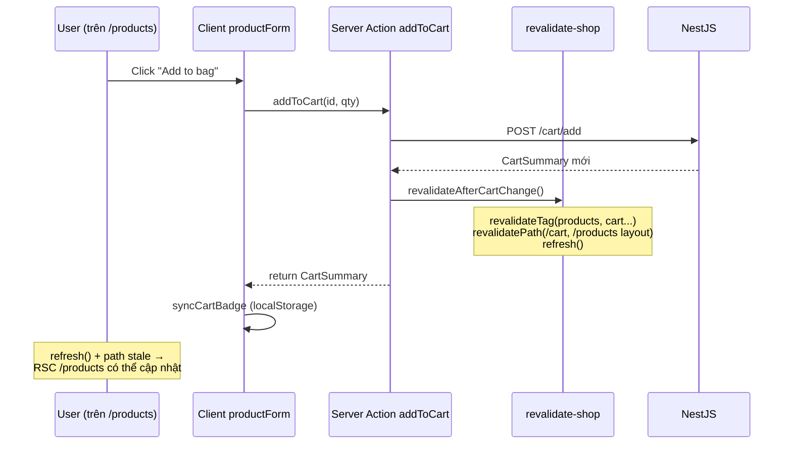
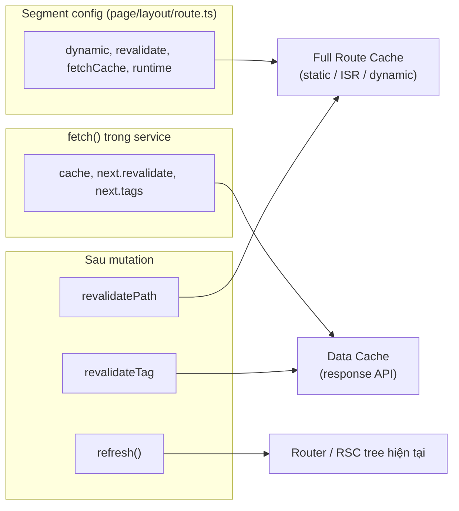

# 5. Data Fetching, Cache & Revalidation — Hướng dẫn chi tiết

Tài liệu này giải thích **cách Next.js lấy và cache dữ liệu** trong App Router, và **cách Nova Shop** áp dụng (`revalidateTag`, `revalidatePath`, `refresh()`).

**Đọc theo thứ tự:** Mục 1 → 2 → 3 (nền tảng) → 4–6 (3 công cụ revalidate) → 7 (Nova Shop end-to-end) → 8 (FAQ).

**Docs chính thức:** [Fetching](https://nextjs.org/docs/app/getting-started/fetching) · [Caching](https://nextjs.org/docs/app/guides/caching) · [Mutating Data](https://nextjs.org/docs/app/getting-started/mutating-data)

---

## Mục lục

1. [Vấn đề cần giải quyết](#1-vấn-đề-cần-giải-quyết)
2. [Data fetching chạy ở đâu trong Nova Shop?](#2-data-fetching-chạy-ở-đâu-trong-nova-shop)
3. [Bốn lớp cache — hiểu trước khi code](#3-bốn-lớp-cache--hiểu-trước-khi-code)
4. [Tùy chọn `fetch()` — cache, revalidate, tags](#4-tùy-chọn-fetch--cache-revalidate-tags)
5. [`revalidateTag` — xóa cache theo nhãn](#5-revalidatetag--xóa-cache-theo-nhãn)
6. [`revalidatePath` — buộc route render lại](#6-revalidatepath--buộc-route-render-lại)
7. [`refresh()` — làm mới route hiện tại](#7-refresh--làm-mới-route-hiện-tại)
8. [Tại sao Nova dùng cả ba?](#8-tại-sao-nova-dùng-cả-ba)
9. [Luồng thực tế trong Nova Shop](#9-luồng-thực-tế-trong-nova-shop)
10. [authFetch & service layer](#10-authfetch--service-layer)
11. [FAQ & lỗi thường gặp](#11-faq--lỗi-thường-gặp)
12. [Bản đồ file trong repo](#12-bản-đồ-file-trong-repo)
13. [Route Segment Config — vai trò & mối liên hệ cache](#13-route-segment-config--vai-trò--mối-liên-hệ-cache)

---

## 1. Vấn đề cần giải quyết

Khi user mở trang `/products`, Next.js phải:

1. Gọi API NestJS lấy danh sách sản phẩm.
2. Render HTML/React Server Components (RSC).
3. Gửi kết quả xuống browser.

**Nếu mỗi lần click đều gọi API từ đầu** → chậm, tốn tài nguyên server.

**Nếu cache quá mạnh** → user thấy giỏ hàng cũ sau khi đã thêm sản phẩm.

→ Cần **chiến lược cache** + **cách “báo” Next.js khi data đã đổi** (revalidate).

---

## 2. Data fetching chạy ở đâu trong Nova Shop?

Nova Shop **không** gọi API trực tiếp trong JSX của page. Luồng chuẩn:

```text
┌─────────────────────────────────────────────────────────────┐
│  Browser                                                     │
│    Chỉ nhận HTML + RSC payload (đã có data embed)           │
└───────────────────────────▲─────────────────────────────────┘
                            │
┌───────────────────────────┴─────────────────────────────────┐
│  Next.js Server                                              │
│                                                              │
│  page.tsx (Server Component, async)                          │
│       │                                                      │
│       ▼                                                      │
│  getProducts() / getCartSummary()   ← app/lib/services/*.ts │
│       │                                                      │
│       ▼                                                      │
│  authFetch() / fetch()              ← app/lib/api-client.ts │
│       │                                                      │
│       ▼                                                      │
│  NestJS API (NEXT_PUBLIC_EXTERNAL_API_URL)                   │
└─────────────────────────────────────────────────────────────┘
```

**Ví dụ thật** — `app/(shop)/products/page.tsx`:

```tsx
export default async function ProductsPage(props) {
  const filters = parseProductFilters(await props.searchParams);
  const result = await getProducts({ ...filters }); // ← fetch trên SERVER
  return <ListProductsComponent products={result.products} />;
}
```

| Câu hỏi | Trả lời |
|----------|---------|
| `getProducts` chạy ở browser? | **Không** — chỉ trên server (Server Component hoặc Server Action). |
| Client có thấy URL API NestJS? | Có thể thấy `NEXT_PUBLIC_*` env; token **không** lộ (HttpOnly cookie + server fetch). |
| Sau khi user thêm giỏ, ai cập nhật cache? | Server Action `addToCart` → `revalidateAfterCartChange()`. |

---

## 3. Bốn lớp cache — hiểu trước khi code

Next.js không chỉ có “một cache”. Có **4 lớp** (theo [Caching Guide](https://nextjs.org/docs/app/guides/caching)):



### 3.1 Request memoization (trong một request)

Trong **cùng một lần** render server (một request HTTP):

```tsx
// Cả hai dòng dùng chung 1 kết quả fetch — không gọi API 2 lần
const a = await getProducts({ page: 1 });
const b = await getProducts({ page: 1 });
```

→ Tiết kiệm khi layout + page cùng cần data giống nhau.

### 3.2 Data Cache (quan trọng nhất với `fetch`)

Khi bạn `fetch(url, { next: { revalidate: 60 } })`, Next.js **lưu response** vào Data Cache.

- Request tiếp theo trong 60 giây → có thể **dùng bản cache**, không gọi API.
- Hết 60 giây → revalidate nền (ISR) hoặc fetch mới tùy cấu hình.

**`revalidateTag('products')`** xóa các entry trong Data Cache có gắn tag `products`.

### 3.3 Full Route Cache

Cache **toàn bộ output** của route (đã render xong). Liên quan static/ISR pages.

**`revalidatePath('/products')`** đánh dấu route đó “cũ” → lần request sau build/render lại.

### 3.4 Router Cache (phía client)

Khi user dùng `<Link>` điều hướng, Next.js có thể giữ snapshot route trên client để back/forward mượt.

→ Khác với Data Cache server; ít khi bạn chỉnh trực tiếp.

### Bảng tóm tắt — “Công cụ nào ảnh hưởng lớp nào?”

| Công cụ | Chủ yếu ảnh hưởng |
|---------|-------------------|
| `fetch` + `revalidate` / `tags` | **Data Cache** |
| `revalidateTag('x')` | **Data Cache** (entry có tag `x`) |
| `revalidatePath('/path')` | **Full Route Cache** + RSC payload của route |
| `refresh()` | **Router / RSC tree** của route **hiện tại** (không đổi URL) |
| `cache: 'no-store'` | **Không** lưu Data Cache (luôn fetch mới khi render) |
| `export const dynamic` / `revalidate` | **Full Route Cache** — static / ISR / dynamic ([mục 13](#13-route-segment-config--vai-trò--mối-liên-hệ-cache)) |
| `export const fetchCache` | Mặc định **Data Cache** cho mọi `fetch` trong segment |

---

## 4. Tùy chọn `fetch()` — cache, revalidate, tags

### 4.1 Ba chế độ hay dùng

| Chế độ | Code | Hành vi | Dùng khi |
|--------|------|---------|----------|
| **Static / force-cache** | mặc định (một số case) | Cache lâu | Content ít đổi, không cá nhân hóa |
| **ISR** | `next: { revalidate: 60 }` | Cache 60s, sau đó làm mới | Catalog public, blog |
| **Dynamic** | `cache: 'no-store'` | Mỗi lần render = fetch mới | Giỏ hàng, profile, data theo user |

**Ví dụ ISR** (Nova — trang chủ featured products):

```ts
// getProducts(..., { authenticated: false })
await fetch(url, {
  method: "GET",
  next: {
    tags: ["products", "catalog"],
    revalidate: 60,  // sau 60 giây có thể fetch lại
  },
});
```

**Ví dụ dynamic** (Nova — giỏ hàng):

```ts
await authFetch(`${apiUrl}/cart?userId=${userId}`, {
  method: "GET",
  cache: "no-store",  // KHÔNG lưu Data Cache
  next: { tags: ["cart", "cart-user-123"] },
});
```

### 4.2 Tags là gì? (nhãn gắn lên fetch)

Tags giống **nhãn dán** trên một bản ghi cache:

```ts
fetch("/api/products?page=1", { next: { tags: ["products"] } });
fetch("/api/products?page=2", { next: { tags: ["products"] } });
```

Sau đó:

```ts
revalidateTag("products"); // xóa MỌI fetch có tag "products" (mọi page, mọi query)
```

Nova định nghĩa tập trung tại `app/lib/cache-tags.ts`:

```ts
export const CACHE_TAGS = {
  products: "products",
  catalog: "catalog",
  product: (id) => `product-${id}`,
  cart: "cart",
  cartUser: (userId) => `cart-user-${userId}`,
  user: "user",
  userId: (id) => `user-${id}`,
};
```

### 4.3 `no-store` + `tags` cùng lúc — có vẻ mâu thuẫn?

```ts
cache: "no-store",
next: { tags: ["cart"] },
```

| Phần | Ý nghĩa |
|------|---------|
| `no-store` | Mỗi lần **render** route → **luôn** gọi API mới (không đọc Data Cache cũ). |
| `tags` | Vẫn gắn nhãn để `revalidateTag("cart")` **đánh dấu stale** + phối hợp `revalidatePath` / `refresh`. |

→ Tags trên `no-store` **không** thay thế `revalidatePath` + `refresh` cho cart; Nova vẫn gọi đủ ba thứ sau mutation (xem mục 8).

---

## 5. `revalidateTag` — xóa cache theo nhãn

### 5.1 Làm gì?

```ts
import { revalidateTag } from "next/cache";

revalidateTag("products");
```

→ Next.js **invalidate** mọi entry trong **Data Cache** đã gắn tag `products`.

### 5.2 Timeline ví dụ

```text
T=0s    User A mở trang chủ → fetch featured products → cache 60s (tag: products)
T=10s   User B thêm vào giỏ → addToCart() → revalidateTag("products")
T=11s   User C mở trang chủ → Data Cache "products" đã stale → fetch API mới
```

### 5.3 Khi KHÔNG có tác dụng

- Fetch dùng **`cache: 'no-store'`** → không có entry trong Data Cache → `revalidateTag` **không** “xóa” được gì cho request đó.
- Vẫn nên gọi `revalidateTag` trong Nova vì:
  - Có fetch **có cache** cùng tag (catalog ISR trên home).
  - Đồng bộ với chiến lược invalidate tập trung.

### 5.4 Nova gọi ở đâu?

`app/lib/revalidate-shop.ts` → `revalidateAfterCartChange()`:

```ts
revalidateTag(CACHE_TAGS.cart);
revalidateTag(CACHE_TAGS.products);
revalidateTag(CACHE_TAGS.catalog);
if (userId) revalidateTag(CACHE_TAGS.cartUser(userId));
```

---

## 6. `revalidatePath` — buộc route render lại

### 6.1 Làm gì?

```ts
import { revalidatePath } from "next/cache";

revalidatePath("/cart");
revalidatePath("/products", "layout");
revalidatePath("/", "layout");
```

→ Đánh dấu **route segment** (và tùy chọn **layout** cha) là **stale**.

Lần user (hoặc server) request `/cart` tiếp theo → Next.js **render lại** Server Components của route đó → gọi lại `getCartSummary()`, `getProducts()`, v.v.

### 6.2 `page` vs `layout`

| Gọi | Ý nghĩa |
|-----|---------|
| `revalidatePath('/products')` | Chỉ page `/products` |
| `revalidatePath('/products', 'layout')` | Layout `(shop)` bọc products **và** mọi page con (navbar có thể re-fetch) |

Nova dùng `'layout'` cho `/products` và `/` vì **navbar / shell** có thể phụ thuộc data chung.

### 6.3 Khác `revalidateTag`

| | `revalidateTag` | `revalidatePath` |
|---|-----------------|------------------|
| Đích | Entry **fetch** trong Data Cache | **Route** đã render (RSC tree) |
| Biết URL API? | Không cần — theo tag | Không — theo path app |
| Cart `no-store` | Gần như không đụng Data Cache | **Vẫn cần** — buộc page cart render lại |

---

## 7. `refresh()` — làm mới route hiện tại

### 7.1 Làm gì?

```ts
import { refresh } from "next/cache";

refresh();
```

→ Trong **cùng request / Server Action**, sau khi mutation xong, Next.js **re-render Server Components** trên route user đang xem — **không** đổi URL, **không** full page reload như F5.

### 7.2 So sánh trực quan

| Hành động | URL đổi? | Full reload? | Ai trigger? |
|-----------|----------|--------------|-------------|
| User click `<Link>` | Có | Không (client nav) | User |
| `router.refresh()` (client) | Không | Không | Client |
| `refresh()` (server, trong Action) | Không | Không | Server Action |
| `revalidatePath` | Không ngay | Không ngay | Server — có hiệu lực **request sau** |
| F5 | Không | **Có** | User |

### 7.3 `refresh()` vs `revalidatePath`

- **`revalidatePath`**: đánh dấu cache route — hiệu lực mạnh cho **lần truy cập sau**.
- **`refresh()`**: cố gắng cập nhật **ngay** UI server của route hiện tại sau Action.

Nova gọi **cả hai** sau `addToCart` để user thấy data mới nhất dù đang ở `/products` hay `/cart`.

### 7.4 Gọi từ client

```ts
// app/lib/actions.ts
"use server";
export async function refreshShopData() {
  refresh(); // qua refreshShopRoute()
}
```

Client gọi khi cần soft-refresh mà không có mutation trả full RSC payload.

### 7.5 Webhook Stripe: `refreshRoute: false`

Trong `checkout-sessions.ts`, webhook **không** có “user đang xem route nào”:

```ts
revalidateAfterCartChange({ refreshRoute: false });
```

→ Chỉ `revalidateTag` + `revalidatePath`; **không** `refresh()` (vô nghĩa trên background job).

---

## 8. Tại sao Nova dùng cả ba?

Đây là điểm **dễ nhầm nhất**. Gom lại một bảng:

| Công cụ | Giải quyết vấn đề |
|---------|-------------------|
| `revalidateTag` | Catalog ISR trên home (`revalidate: 60`) vẫn hiển thị tồn kho/giá cũ sau khi đổi giỏ / webhook |
| `revalidatePath` | Page `/cart`, layout `/products` (navbar, list) phải chạy lại `getCartSummary`, `getProducts` |
| `refresh()` | User đang đứng trên `/products` sau khi thêm giỏ — thấy cập nhật **ngay** không cần navigate |



**Tóm một câu:**  
- Data **có cache** (catalog) → cần **`revalidateTag`**.  
- Data **`no-store`** (cart) → cần **`revalidatePath`** + **`refresh()`** để render lại.

---

## 9. Luồng thực tế trong Nova Shop

### 9.1 Đọc danh sách sản phẩm (`/products`)

```text
1. User mở /products?page=2&sort=price-low
2. products/page.tsx (Server) await searchParams
3. parseProductFilters() → object an toàn
4. getProducts({ page: 2, sort: "price-low" })  [authenticated: true mặc định]
5. authFetch GET .../products?... với cache: "no-store" + tags
6. Trả ProductsPageResult → ListProductsComponent
```

**Tại sao `no-store` cho catalog đã login?**  
Route dynamic (cookie auth); mỗi user/session nên thấy data mới khi render, tránh lẫn cache giữa user trên shared Data Cache.

**Trang chủ featured** dùng `authenticated: false` + `revalidate: 60` → **ISR**, tiết kiệm API.

### 9.2 Thêm giỏ hàng

```text
1. productForm (client) gọi addToCart()
2. cart.ts: authFetch POST /cart/add
3. revalidateCartCaches({ productId })
   → revalidateAfterCartChange({ userId, productId, refreshRoute: true })
4. Trả CartSummary cho client → cập nhật UI + badge
```

### 9.3 Thanh toán thành công (webhook)

```text
1. Stripe POST /api/stripe/webhook
2. handleSuccessfulPayment()
3. revalidateAfterCartChange({ refreshRoute: false })
4. revalidateProductsCatalog({ refreshRoute: false })
```

---

## 10. authFetch & service layer

### 10.1 authFetch (tóm tắt)

File: `app/lib/api-client.ts`

```text
ensureValidAccessToken()
    → refresh nếu access token hết hạn
getAuthHeaders()
    → Authorization: Bearer + Cookie
fetch(url, init)
    → nếu 401: refreshTokens() + retry 1 lần
```

**Luôn truyền `init` cache/tags** từ service — `authFetch` không tự quyết định cache:

```ts
authFetch(url, {
  method: "GET",
  cache: "no-store",
  next: { tags: productTags },
});
```

### 10.2 Service layer

| File | Hàm đọc | Hàm ghi (mutation) |
|------|---------|---------------------|
| `services/products.ts` | `getProducts`, `getProductById` | — |
| `services/cart.ts` | `getCartSummary` | `addToCart`, `updateCartItem`, … |
| `services/user.ts` | `getUser` | — |
| `revalidate-shop.ts` | — | `revalidateAfterCartChange` (helper) |

**Quy tắc:** Page **không** gọi `fetch` trực tiếp; chỉ gọi service.

### 10.3 Xử lý lỗi

```ts
if (res.status === 401) unauthorized();      // redirect auth flow
if (res.status === 404) return EMPTY_CART;  // giỏ trống
if (!res.ok) return EMPTY_RESULT;           // catalog fallback
```

→ Trang không sập vì API lỗi tạm thời (trừ detail product `throw`).

### 10.4 parseProductFilters

`searchParams` từ URL là string — parse một chỗ:

```ts
const page = Math.max(1, Number(params.page) || 1);
```

Tránh `NaN` trên pagination.

---

## 11. FAQ & lỗi thường gặp

### Q1: Thêm giỏ rồi mà `/cart` vẫn cũ?

**Kiểm tra:**

1. `addToCart` có gọi `revalidateAfterCartChange` không?
2. Page cart có đọc `initialSummary` từ server lần đầu rồi chỉ `useState` — cần navigate lại hoặc dựa vào `refresh()` / `initialSummary` đổi từ server.
3. Client cart-view cập nhật local state từ Action return — OK; nhưng **reload F5** mới thấy server data nếu thiếu revalidate.

### Q2: Chỉ dùng `revalidateTag` có đủ không?

**Không** cho cart `no-store`. Cần thêm `revalidatePath` + `refresh()`.

### Q3: `revalidate: 60` nghĩa là user luôn thấy data cũ 60 giây?

Trong 60 giây **có thể** dùng cache. Sau 60 giây request tiếp theo trigger revalidate.  
**Hoặc** ngay lập tức nếu có `revalidateTag('products')` (mutation/webhook).

### Q4: `getProducts` gọi từ navbar client được không?

Được (Server Action) nhưng **không khuyến nghị** — thêm round-trip. Nên fetch trên layout server, truyền props xuống navbar.

### Q5: Khác `router.refresh()` (client) với `refresh()` (server)?

Cùng mục tiêu “làm mới RSC”. Nova expose `refreshShopData()` Server Action để client gọi `refresh()` từ server context.

### Q6: Env `NEXT_PUBLIC_EXTERNAL_API_URL` có lộ secret không?

Chỉ **URL** public. Token nằm HttpOnly cookie, chỉ server đọc được khi `authFetch`.

### Q7: Segment config khác `fetch({ cache: 'no-store' })` thế nào?

| | Segment config (`export const` trong `page.tsx`) | `fetch()` options |
|---|--------------------------------------------------|-------------------|
| **Phạm vi** | Cả **route segment** (folder + layout con) | **Từng lần gọi** API |
| **Ai đọc** | Next.js khi **build** và khi **routing** | Next.js khi **thực thi** `fetch` trong component |
| **Ảnh hưởng chính** | Static vs dynamic route, Full Route Cache, mặc định fetch trong segment | Data Cache (lưu hay không response API) |
| **Ví dụ Nova** | `export const dynamic = 'force-dynamic'` trên `/cart` | `cache: 'no-store'` trong `getCartSummary()` |

Cần **cả hai** khi route phải luôn render theo request (segment) **và** từng API call không được cache chung user (fetch). Chỉ set fetch mà không set segment → route vẫn có thể bị coi là static/ISR và cache **HTML + RSC payload** (lớp 3).

### Q8: Tại sao không import `dynamic` từ `segment-config.ts`?

Next.js phân tích **tĩnh** file route lúc build — chỉ nhận **literal** (`export const dynamic = "force-dynamic"`). Re-export từ module khác → build cảnh báo và **bỏ qua** config. File `app/lib/segment-config.ts` chỉ là **tham chiếu** để đồng bộ giá trị với team.

---

## 12. Bản đồ file trong repo

```text
app/lib/
├── cache-tags.ts          # Hằng số tag
├── revalidate-shop.ts     # revalidateTag + revalidatePath + refresh()
├── api-client.ts          # authFetch
└── services/
    ├── products.ts        # getProducts (ISR vs no-store)
    ├── cart.ts            # cart + revalidate sau mutation
    └── user.ts            # getUser (no-store + tags)

app/lib/actions.ts         # refreshShopData() → refresh()
app/lib/checkout-sessions.ts  # webhook → revalidate (no refresh)

app/(shop)/products/page.tsx   # getProducts()
app/ui/shop/storefront-hero.tsx # getProducts({ authenticated: false })
app/lib/segment-config.ts      # Tham chiếu giá trị (literal phải ghi trong từng page)
app/lib/services/products.ts   # getAllProductSlugParams() — build + sitemap
```

---

## 13. Route Segment Config — vai trò & mối liên hệ cache

**Docs:** [Route Segment Config](https://nextjs.org/docs/app/api-reference/file-conventions/route-segment-config)

### 13.1 Segment config là gì?

Trong App Router, **mỗi folder** (`app/`, `app/(shop)/`, `app/(shop)/products/`, …) là một **route segment**. Bạn khai báo hành vi của segment đó bằng cách **export hằng số** ngay trong file convention:

```tsx
// app/(shop)/cart/page.tsx
export const dynamic = "force-dynamic";
export const fetchCache = "default-no-store";

export default async function CartPage() { /* ... */ }
```

Đây **không phải** props React và **không** truyền xuống component con — Next.js đọc khi **build** và khi **xử lý request** để quyết định segment đó được render/cache thế nào.

**Segment config trả lời câu hỏi:** *“Route `/cart` này là trang tĩnh build sẵn, ISR, hay bắt buộc chạy lại mỗi request?”*

### 13.2 Vai trò — tại sao cần ngoài `fetch()`?

Ở [mục 3](#3-bốn-lớp-cache--hiểu-trước-khi-code) có **4 lớp cache**. Segment config chủ yếu điều khiển **lớp 3 (Full Route Cache)** và **mặc định** cho fetch trong segment — **không thay thế** `revalidateTag` / `revalidatePath` / `refresh()`.



| Tầng | Công cụ | Vai trò |
|------|---------|---------|
| **Khai báo** (trước runtime) | Segment config | Route này static, ISR, hay dynamic; runtime Node/Edge |
| **Lấy data** (khi render) | `fetch` / `authFetch` | Cache từng response API hay không |
| **Sau khi đổi data** | `revalidateTag`, `revalidatePath`, `refresh` | Xóa cache cũ, buộc render lại |

**Ví dụ dễ hiểu:**

- Chỉ `fetch(..., { cache: 'no-store' })` trong `getCartSummary()` → API không vào Data Cache, **nhưng** Next.js vẫn *có thể* cache **output đã render** của `/cart` (HTML + RSC) nếu segment được coi là static.
- Thêm `export const dynamic = 'force-dynamic'` trên `cart/page.tsx` → segment **luôn** render theo request → khớp giỏ hàng theo user.

→ Segment config = **“luật chơi của cả trang”**; `fetch` options = **“luật chơi của từng API call”**.

### 13.3 Các option Nova dùng — ý nghĩa từng cái

| Option | Giá trị Nova | Tác dụng |
|--------|--------------|----------|
| **`revalidate`** | `60` trên `/` | **ISR segment:** tái tạo route tối đa mỗi 60s (khớp featured products). Không dùng trên trang auth. |
| **`dynamic`** | `'force-dynamic'` trên shop/auth/checkout | **Không** build static HTML cho segment; mỗi request render server mới. Cần khi có `cookies()`, `headers()`, `searchParams`, session. |
| **`fetchCache`** | `'default-no-store'` trên shop | Fetch trong segment **mặc định** không ghi Data Cache (bổ sung cho `cache: 'no-store'` trong service). |
| **`runtime`** | `'nodejs'` trên API Stripe/Auth | Route Handler chạy **Node.js** (Stripe SDK, `crypto`, raw body webhook). |

**`dynamic` — các giá trị hay gặp:**

| Giá trị | Hành vi |
|---------|---------|
| `'auto'` (mặc định) | Static nếu không dùng dynamic APIs; dynamic nếu có `cookies()` / `searchParams` / … |
| `'force-static'` | Cố static (ít dùng cho shop có login) |
| `'force-dynamic'` | Luôn dynamic — Nova dùng cho `/products`, `/cart`, … |
| `'error'` | Build lỗi nếu phát hiện dynamic API |

Nova chọn **`force-dynamic` rõ ràng** trên route auth thay vì `'auto'` để tránh nhầm lẫn khi refactor (bỏ `cookies()` tạm thời → route lỡ thành static).

### 13.4 Segment config vs `revalidateTag` / `revalidatePath` / `refresh`

| | Segment config | `revalidateTag` / `revalidatePath` / `refresh` |
|---|----------------|--------------------------------------------------|
| **Khi áp dụng** | Mỗi request / build (quy tắc cố định) | **Sau sự kiện** (thêm giỏ, webhook Stripe, …) |
| **Ai gọi** | Developer khai báo trong file route | Code runtime (`revalidate-shop.ts`, actions) |
| **Thay đổi** | Deploy mới code | Một lần invalidate cache hiện có |

Chúng **bổ sung nhau:**

1. Segment `force-dynamic` + `fetch no-store` → baseline: data và route luôn “tươi” khi render.
2. User thêm giỏ → `revalidateTag` + `revalidatePath` + `refresh()` → xóa cache còn sót, cập nhật UI ngay không cần F5.

### 13.5 Nova Shop — hai preset

**Preset A — Catalog public (trang chủ `/`)**

```tsx
// app/page.tsx
export const revalidate = 60;
```

```ts
// getProducts({ authenticated: false }) trong storefront-hero
fetch(url, { next: { revalidate: 60, tags: ["products", "catalog"] } });
```

- Segment ISR **60s** + Data Cache ISR **60s** → cùng TTL, home load nhanh, catalog không cần login.
- Sau admin sửa sản phẩm / webhook: vẫn cần `revalidateTag('products')` — segment config **không** tự biết data đổi.

**Preset B — Auth / per-user (shop, cart, checkout success)**

```tsx
export const dynamic = "force-dynamic";
export const fetchCache = "default-no-store";
```

```ts
await authFetch(url, { cache: "no-store", next: { tags: [...] } });
```

- Segment không static + API không cache chung user.
- `(shop)/layout.tsx` set preset B → **mọi trang con** (`/products`, `/cart`, …) kế thừa — không phải lặp lại trên từng `page.tsx` (Nova vẫn export lại trên page để rõ intent khi đọc file).

**Preset C — API Route Handler (Stripe, NextAuth)**

```ts
export const dynamic = "force-dynamic";
export const runtime = "nodejs";
```

- Mỗi POST là request riêng; Stripe cần Node runtime.

### 13.6 Kế thừa layout → page

Config trên **layout cha** áp dụng cho **cả cây segment con**, trừ khi page con **ghi đè**:

```text
app/(shop)/layout.tsx     → dynamic + fetchCache
    └── products/page.tsx → (cùng hoặc ghi đè)
    └── cart/page.tsx
```

Rule thực tế: segment **“dynamic nhất”** thắng — con `force-dynamic` không bị layout static “kéo ngược”.

### 13.7 Quy tắc literal (Next.js build)

```tsx
// ❌ Build bỏ qua — Next không phân tích được
export { dynamic } from "@/app/lib/segment-config";

// ✅
export const dynamic = "force-dynamic";
```

File `app/lib/segment-config.ts` ghi hằng `CATALOG_REVALIDATE_SECONDS`, `AUTH_DYNAMIC`, … để **đồng bộ tài liệu + code review** — giá trị thật vẫn phải copy literal vào từng `page.tsx` / `layout.tsx` / `route.ts`.

### 13.8 Bảng segment config theo từng page Nova

| Route / file | `revalidate` | `dynamic` | `fetchCache` | `runtime` | Lý do |
|--------------|-------------|-----------|--------------|-----------|--------|
| `/` — `app/page.tsx` | `60` | — | — | — | Landing public; FeaturedProducts ISR |
| `(shop)/layout.tsx` | — | `force-dynamic` | `default-no-store` | — | Toàn shop auth/cookies |
| `/products` — `(shop)/products/page.tsx` | — | ✓ | ✓ | — | `authFetch`, `searchParams` |
| `/products/[slug]` | `60` | — | — | — | ISR + `generateStaticParams`; runtime auth qua `getCatalogAuthenticated` |
| `/cart` | — | ✓ | ✓ | — | `getCartSummary` per-user |
| `/customers` | — | ✓ | ✓ | — | Route bảo vệ middleware |
| `/login` | — | ✓ | ✓ | — | Redirect session |
| `checkout/layout.tsx` | — | ✓ | ✓ | — | Success đọc Stripe + `searchParams` |
| `/checkout/success` | — | ✓ | ✓ | — | `retrieveCheckoutSession` |
| `/checkout/cancel` | — | ✓ | ✓ | — | Cùng layout checkout |
| `POST /api/checkout` | — | ✓ | — | `nodejs` | Stripe SDK |
| `POST /api/checkout/cart` | — | ✓ | — | `nodejs` | Stripe + cart |
| `POST /api/stripe/webhook` | — | ✓ | — | `nodejs` | Webhook raw body |
| `/api/auth/[...nextauth]` | — | ✓ | — | `nodejs` | NextAuth handlers |

✓ = `export const dynamic = "force-dynamic"` và `fetchCache = "default-no-store"` (literal trong file).

---

## Phụ lục: Bảng `fetch` options (tra cứu nhanh)

| Option | Data Cache | Khi nào dùng |
|--------|------------|--------------|
| (mặc định static) | Có, lâu | Ít dùng cho API động |
| `next: { revalidate: N }` | Có, TTL N giây | Catalog public |
| `cache: 'no-store'` | Không | Cart, user, auth API |
| `next: { tags: [...] }` | Gắn nhãn | Kết hợp với `revalidateTag` |
| `revalidateTag('x')` | Invalidate theo tag | Sau mutation / webhook |
| `revalidatePath('/p')` | Invalidate route | Sau mutation |
| `refresh()` | Re-render route hiện tại | Trong Server Action |
| `export const dynamic` | Full Route Cache / static vs dynamic | [Mục 13](#13-route-segment-config--vai-trò--mối-liên-hệ-cache) |
| `export const revalidate` | ISR cho **cả segment** | Home `/` = 60 |
| `export const fetchCache` | Mặc định fetch trong segment | Shop = `default-no-store` |
| `export const runtime` | Node vs Edge cho Route Handler | Stripe API = `nodejs` |

---

## Bài tập tự kiểm tra

1. Vẽ lại sequence: user thêm giỏ khi đang ở `/products` — chỉ rõ bước nào dùng tag, path, refresh.
2. Tại sao featured products trên home dùng `authenticated: false` + `revalidate: 60`?
3. Stripe webhook tại sao `refreshRoute: false`?
4. Nếu xóa `revalidatePath("/cart")` khỏi `revalidateAfterCartChange`, điều gì có thể xảy ra khi user mở `/cart` sau khi thêm hàng ở trang khác?
5. Chỉ dùng `cache: 'no-store'` trong `getCartSummary()` mà **không** có `export const dynamic = 'force-dynamic'` trên `/cart` — Full Route Cache có thể bị ảnh hưởng thế nào?

**Đáp án gợi ý:**

1. Action → API → `revalidateTag` (catalog cache) → `revalidatePath` (cart, products layout) → `refresh()` (route hiện tại) → client nhận `CartSummary`.
2. Home có thể public/ISR; không bắt buộc token; giảm tải API.
3. Webhook không có “current route” của browser.
4. Cart page có thể vẫn render với RSC payload cũ cho đến khi navigate/reload — dù `no-store` fetch mới khi **thực sự** re-render route.
5. Response API luôn mới khi render, nhưng **output route** (RSC/HTML) vẫn có thể bị cache nếu segment static — user có thể thấy giỏ cũ cho đến khi navigate/revalidate path; đó là lý do Nova set `force-dynamic` trên segment.

---

**Xem thêm:** [3. Server Actions](./3.%20Server%20Actions.md) · [0. Best Practices vs Nova](./0.%20Next.js%20Official%20Docs%20Mapping%20va%20Best%20Practices.md)
