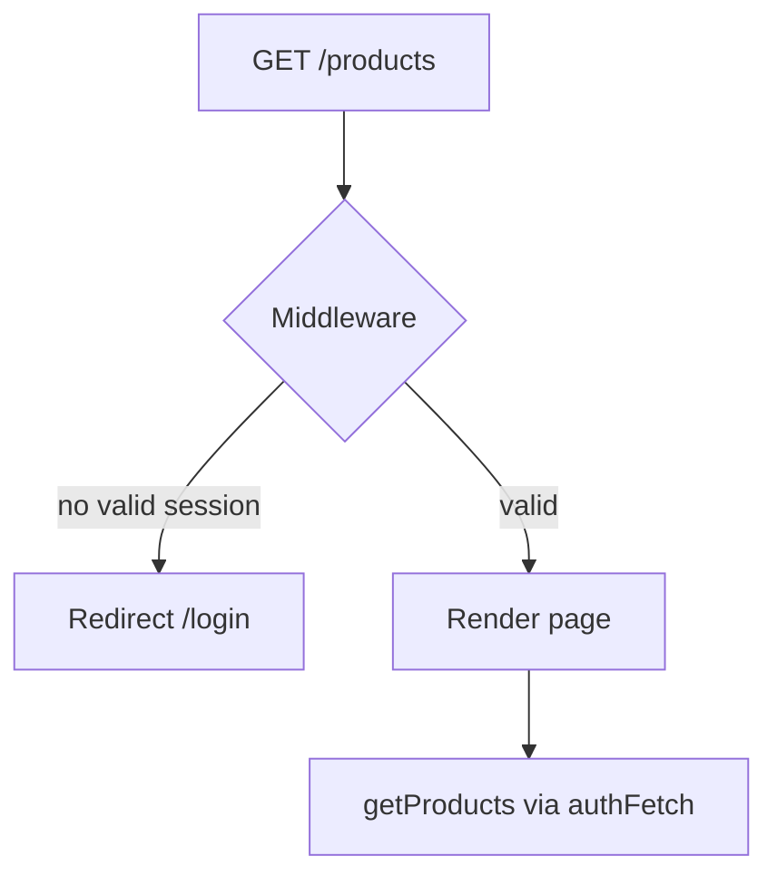

# 6. Middleware

Middleware chạy **trước** khi request hoàn tất — trên Edge runtime — dùng cho auth gate, redirect, rewrite header.

---

## 6.1 File và export

```ts
// middleware.ts (root project)
import NextAuth from "next-auth";
import { authConfig } from "./auth.config";

export default NextAuth(authConfig).auth;

export const config = {
  matcher: [
    "/((?!api|_next/static|_next/image|favicon.ico|.*\\..*).*)",
  ],
};
```

- `export default` — hàm middleware.
- `config.matcher` — regex path **áp dụng** middleware.

---

## 6.2 Matcher — hiểu regex Nova Shop

```text
/((?!api|_next/static|_next/image|favicon.ico|.*\..*).*)
```

| Loại trừ | Lý do |
|----------|--------|
| `api` | Route Handlers, webhook Stripe |
| `_next/static`, `_next/image` | Asset Next.js |
| `favicon.ico` | Icon |
| `.*\..*` | File có extension (`.png`, `.css`) |

→ Middleware chủ yếu chạy cho **page navigation**, không chặn `/api/checkout`.

---

## 6.3 NextAuth middleware integration

NextAuth v5 export `.auth` từ config — callback `authorized` quyết định allow/redirect.

```ts
// auth.config.ts
callbacks: {
  authorized({ auth, request: { nextUrl, cookies } }) {
    const isLoggedIn = !!auth?.user;
    const hasAccessToken = !!cookies.get("access_token")?.value;
    const hasRefreshToken = !!cookies.get("refresh_token")?.value;
    const accessExpired = isAccessTokenExpired(
      cookies.get("access_expires_at")?.value,
    );
    const hasValidSession =
      isLoggedIn &&
      ((hasAccessToken && !accessExpired) || hasRefreshToken);

    const isProtectedRoute =
      nextUrl.pathname.startsWith("/products") ||
      nextUrl.pathname.startsWith("/customers") ||
      nextUrl.pathname.startsWith("/cart");

    if (isProtectedRoute) {
      return hasValidSession; // false → redirect login
    }
    if (hasValidSession && nextUrl.pathname === "/login") {
      return Response.redirect(new URL("/products", nextUrl));
    }
    return true;
  },
}
```

---

## 6.4 Dual check: NextAuth session + backend cookies

Nova Shop không chỉ dựa `auth?.user`:

1. **NextAuth JWT session** — user đã signIn.
2. **Cookies backend** — `access_token`, `refresh_token`, `access_expires_at`.
3. Hợp lệ nếu: có access còn hạn **hoặc** còn refresh để renew.

**Lý do:** API NestJS cần Bearer token; NextAuth session alone không đủ gọi API.

---

## 6.5 Luồng user chưa đăng nhập



`pages.signIn: "/login"` trong `authConfig`.

---

## 6.6 Middleware thuần (không NextAuth)

```ts
import { NextResponse } from "next/server";
import type { NextRequest } from "next/server";

export function middleware(request: NextRequest) {
  const token = request.cookies.get("token");
  if (!token && request.nextUrl.pathname.startsWith("/dashboard")) {
    return NextResponse.redirect(new URL("/login", request.url));
  }
  return NextResponse.next();
}
```

---

## 6.7 Giới hạn Middleware

| Không nên | Nên |
|-----------|-----|
| Query database nặng | Check cookie/JWT nhẹ |
| Logic business phức tạp | Đặt trong Server Component / Action |
| Thay thế auth API | Kết hợp với `authFetch` server-side |

Runtime Edge — một số Node API không có.

---

## 6.8 experimental.authInterrupts

Nova Shop `next.config.ts`:

```ts
experimental: {
  authInterrupts: true,
}
```

Hỗ trợ `unauthorized()` / auth interrupt trong App Router — tích hợp flow 401 gọn hơn.

---

## 6.9 Debug middleware

1. Log `nextUrl.pathname` tạm thời (dev only).
2. Kiểm tra cookie trong DevTools → Application.
3. Xác nhận route có nằm trong `matcher` không.
4. API 401 từ page ≠ middleware block — hai lớp khác nhau.

---

## 6.10 Checklist bảo vệ route mới

1. Thêm path vào `isProtectedRoute` trong `authorized`.
2. Đảm bảo login flow set đủ cookies (`setAuthCookies`).
3. Service layer gọi `authFetch` + `unauthorized()` on 401.
4. Không expose secret trong middleware response.
