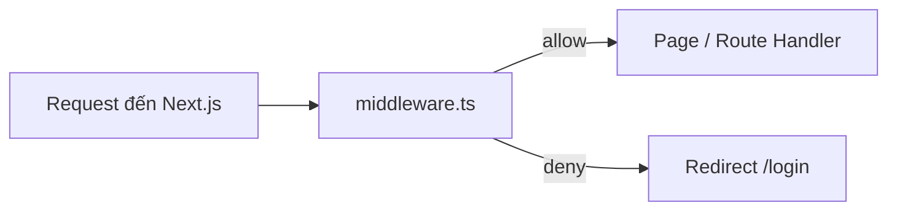
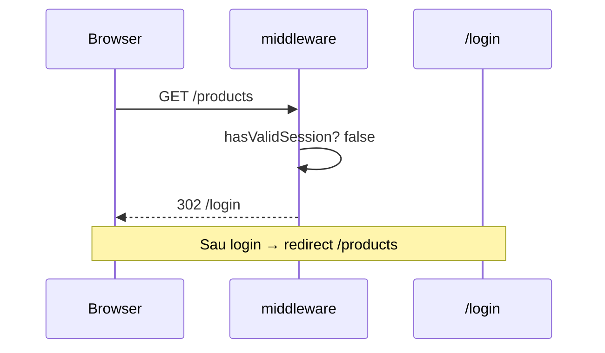

# 6. Middleware — Hướng dẫn chi tiết

Tài liệu giải thích **`middleware.ts`** — chạy **trước** khi request tới page, dùng cho **auth gate**, redirect, và tích hợp NextAuth v5.

**Đọc theo thứ tự:** Mục 1 → 2 (matcher) → 3 (authorized) → 4 (phòng thủ nhiều lớp) → 5 (Nova) → 6 (FAQ).

**Docs:** [Middleware](https://nextjs.org/docs/app/api-reference/file-conventions/middleware) · [Authentication](https://nextjs.org/docs/app/guides/authentication)

---

## Mục lục

1. [Middleware chạy khi nào?](#1-middleware-chạy-khi-nào)
2. [File `middleware.ts` trong Nova Shop](#2-file-middlewarets-trong-nova-shop)
3. [`matcher` — request nào bị chặn?](#3-matcher--request-nào-bị-chặn)
4. [NextAuth `authorized` callback](#4-nextauth-authorized-callback)
5. [Dual auth: NextAuth + backend cookies](#5-dual-auth-nextauth--backend-cookies)
6. [Phòng thủ nhiều lớp — middleware không đủ](#6-phòng-thủ-nhiều-lớp--middleware-không-đủ)
7. [Luồng: user chưa login vào `/products`](#7-luồng-user-chưa-login-vào-products)
8. [Giới hạn Edge runtime](#8-giới-hạn-edge-runtime)
9. [FAQ & debug](#9-faq--debug)
10. [Bản đồ file](#10-bản-đồ-file)

---

## 1. Middleware chạy khi nào?



| | Middleware | Server Component / Action |
|---|------------|---------------------------|
| Thời điểm | **Trước** render | Trong render / mutation |
| Runtime | **Edge** (mặc định) | Node / Edge tùy route |
| Việc nên làm | Đọc cookie, redirect nhẹ | Business logic, `authFetch` |

**Không** gọi NestJS API nặng trong middleware — tăng latency mọi request.

---

## 2. File `middleware.ts` trong Nova Shop

```ts
// middleware.ts (root project)
import NextAuth from "next-auth";
import { authConfig } from "./auth.config";

export default NextAuth(authConfig).auth;

export const config = {
  matcher: [
    "/((?!api|_next/static|_next/image|favicon.ico|.*\\..*).*)",
  ],
};
```

| Phần | Ý nghĩa |
|------|---------|
| `NextAuth(authConfig).auth` | Middleware do Auth.js cung cấp — gọi `callbacks.authorized` |
| `config.matcher` | Regex path **có** chạy middleware |

Logic auth nằm trong `auth.config.ts` → `authorized({ auth, request })`.

---

## 3. `matcher` — request nào bị chặn?

```text
/((?!api|_next/static|_next/image|favicon.ico|.*\..*).*)
```

| Loại trừ | Ví dụ | Vì sao |
|----------|-------|--------|
| `api` | `/api/checkout`, `/api/stripe/webhook` | Route Handler riêng auth |
| `_next/static` | JS, CSS build | Asset |
| `_next/image` | Image optimization | Asset |
| `favicon.ico` | Icon | Asset |
| `.*\..*` | `logo.png`, `file.css` | File tĩnh có extension |

**Hệ quả Nova:**

- User navigate `/products` → **có** middleware.
- Stripe `POST /api/stripe/webhook` → **không** middleware (verify bằng signature).
- `BuyNowButton` `fetch /api/checkout` → **không** middleware.

---

## 4. NextAuth `authorized` callback

```ts
// auth.config.ts (rút gọn)
authorized({ auth, request: { nextUrl, cookies } }) {
  const isLoggedIn = !!auth?.user;
  const hasAccessToken = !!cookies.get("access_token")?.value;
  const hasRefreshToken = !!cookies.get("refresh_token")?.value;
  const accessExpired = isAccessTokenExpired(
    cookies.get("access_expires_at")?.value,
  );

  const hasValidSession =
    isLoggedIn &&
    ((hasAccessToken && !accessExpired) || hasRefreshToken);

  const isProtectedRoute =
    nextUrl.pathname.startsWith("/products") ||
    nextUrl.pathname.startsWith("/customers") ||
    nextUrl.pathname.startsWith("/cart");

  if (isProtectedRoute) {
    return hasValidSession;  // false → redirect signIn page
  }
  if (hasValidSession && nextUrl.pathname === "/login") {
    return Response.redirect(new URL("/products", nextUrl));
  }
  return true;
}
```

| Return | Hành vi |
|--------|---------|
| `true` | Cho phép tiếp tục |
| `false` | Redirect `/login` (`pages.signIn`) |
| `Response.redirect(...)` | Redirect tùy chỉnh |

---

## 5. Dual auth: NextAuth + backend cookies

Nova **không** chỉ tin `auth?.user`:

```text
Lớp 1 — NextAuth session: user đã signIn (JWT session)
Lớp 2 — Backend cookies: access_token, refresh_token, access_expires_at
```

**Hợp lệ khi:**

```text
isLoggedIn AND (access còn hạn OR còn refresh token)
```

**Vì sao?** API NestJS cần `Authorization: Bearer` từ `access_token` — NextAuth session một mình không gọi được API.

Chi tiết cookie: [9. JWT Cookies va Dual Auth](./9.%20JWT%20Cookies%20va%20Dual%20Auth.md)

---

## 6. Phòng thủ nhiều lớp — middleware không đủ

Next.js Authentication Guide:

```text
┌─────────────────────────────────────────┐
│ 1. Middleware      → redirect sớm        │
├─────────────────────────────────────────┤
│ 2. Server Action / Page → authFetch      │
│    unauthorized() on 401               │
├─────────────────────────────────────────┤
│ 3. NestJS API      → validate JWT        │
└─────────────────────────────────────────┘
```

**Tại sao middleware không đủ?**

- User có thể gọi **Server Action** trực tiếp (POST nội bộ) — bypass UI.
- Matcher exclude `/api` — một số endpoint không qua middleware.

→ Nova: `authFetch` + `unauthorized()` ở tầng 2. Xem [5. Data Fetching](./5.%20Data%20Fetching%20va%20Cache.md).

### `experimental.authInterrupts`

```ts
// next.config.ts
experimental: { authInterrupts: true }
```

Hỗ trợ `unauthorized()` tích hợp auth flow Next 15.

---

## 7. Luồng: user chưa login vào `/products`



Sau login thành công: `setAuthCookies` + NextAuth session → middleware pass.

---

## 8. Giới hạn Edge runtime

| Không nên trong middleware | Nên |
|----------------------------|-----|
| Query DB nặng | Đọc cookie |
| `fs`, một số Node crypto | JWT decode nhẹ |
| Gọi NestJS sync | Check cookie có/không |

`auth.config.ts` tách **edge-safe** — providers đầy đủ trong `auth.ts`.

---

## 9. FAQ & debug

### FAQ

**Q: Middleware chặn nhưng API vẫn 401?**  
Hai lớp khác nhau — middleware pass ≠ token còn hạn. `authFetch` refresh hoặc `unauthorized()`.

**Q: Thêm route protected `/orders`?**  
Thêm `nextUrl.pathname.startsWith("/orders")` vào `isProtectedRoute`.

**Q: Trang `/` có cần login?**  
Nova: **không** trong `isProtectedRoute` — landing public.

### Debug checklist

1. DevTools → Application → Cookies: `access_token`, `refresh_token`.
2. Path có match `matcher`?
3. Log `nextUrl.pathname` tạm (dev only).
4. So sánh với Network 401 từ `getProducts`.

### Bài tập

1. Vì sao `/api/checkout` không qua middleware nhưng vẫn an toàn? → Cart checkout gọi `getCartSummary` server-side với cookie.
2. `authorized` return `false` vs `redirect()` custom?

---

## 10. Bản đồ file

```text
middleware.ts           → export NextAuth().auth
auth.config.ts          → authorized, session, pages.signIn
auth.ts                 → providers đầy đủ
next.config.ts          → authInterrupts
app/unauthorized.tsx    → UI 401 (auth interrupt)
```

**Tiếp theo:** [7. Authentication](./7.%20Authentication%20-%20Tong%20quan.md) · [8. NextAuth v5](./8.%20NextAuth%20v5.md)
