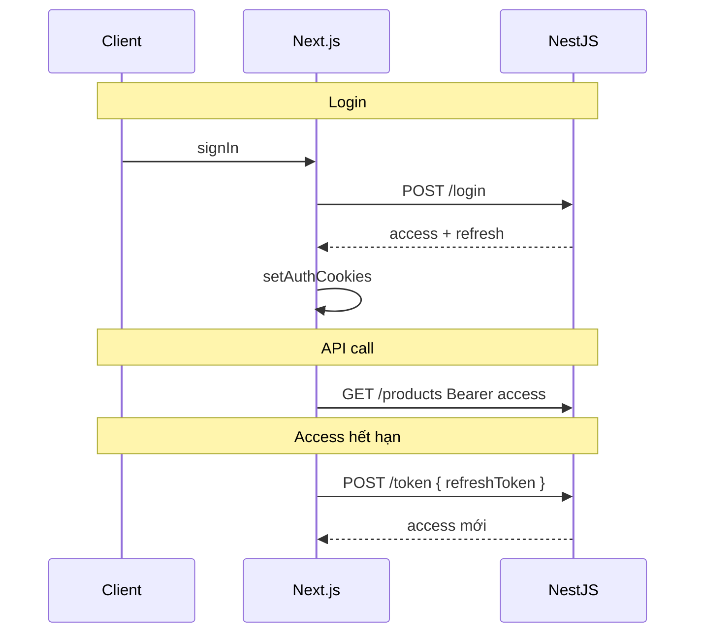

# 7. Authentication — Hướng dẫn chi tiết (tổng quan)

Nền tảng **xác thực (AuthN)** và **phân quyền (AuthZ)** trước khi đọc [8. NextAuth v5](./8.%20NextAuth%20v5.md) và [9. JWT Dual Auth](./9.%20JWT%20Cookies%20va%20Dual%20Auth.md).

**Đọc theo thứ tự:** 7 (file này) → 8 (NextAuth) → 9 (JWT Nova) → 6 (Middleware).

**Docs:** [Authentication Guide](https://nextjs.org/docs/app/guides/authentication)

---

## Mục lục

1. [AuthN vs AuthZ](#1-authn-vs-authz)
2. [Ba giai đoạn trong app thực tế](#2-ba-giai-đoạn-trong-app-thực-tế)
3. [Các mô hình lưu session](#3-các-mô-hình-lưu-session)
4. [Access + Refresh token](#4-access--refresh-token)
5. [Lưu token ở đâu — cookie vs localStorage](#5-lưu-token-ở-đâu--cookie-vs-localstorage)
6. [OAuth / Google login — ý tưởng](#6-oauth--google-login--ý-tưởng)
7. [Credentials login — ý tưởng](#7-credentials-login--ý-tưởng)
8. [Phòng thủ nhiều lớp (Next.js khuyến nghị)](#8-phòng-thủ-nhiều-lớp-nextjs-khuyến-nghị)
9. [Nova Shop dùng mô hình nào?](#9-nova-shop-dùng-mô-hình-nào)
10. [FAQ & bài tập](#10-faq--bài-tập)

---

## 1. AuthN vs AuthZ

| | Authentication (AuthN) | Authorization (AuthZ) |
|---|------------------------|------------------------|
| Câu hỏi | **Bạn là ai?** | **Bạn được làm gì?** |
| Ví dụ | Đăng nhập email/password | Chỉ `admin` xóa sản phẩm |
| Nova | NextAuth + JWT cookies | `/products` cần session; NestJS check role/ownership |

**Nhầm lẫn phổ biến:** Đã login (AuthN) ≠ được sửa đơn người khác (AuthZ).

---

## 2. Ba giai đoạn trong app thực tế

```text
┌──────────────┐    ┌──────────────┐    ┌──────────────┐
│ 1. Login     │ →  │ 2. Session   │ →  │ 3. Gọi API   │
│ verify user  │    │ giữ trạng thái│    │ gửi token    │
└──────────────┘    └──────────────┘    └──────────────┘
```

| Giai đoạn | Nova Shop |
|-----------|-----------|
| Login | `signIn` → NestJS `/login` hoặc `/google` |
| Session | NextAuth JWT + cookies `access_token` |
| API | `authFetch` gắn Bearer |

---

## 3. Các mô hình lưu session

### A. Server-side session (cookie `sessionId`)

```text
Client: cookie sessionId=abc
Server: DB sessions[abc] = { userId, ... }
```

| Ưu | Nhược |
|----|-------|
| Revoke ngay (xóa DB) | Cần Redis/DB |
| Dễ audit | Scale cần shared store |

### B. JWT stateless

```text
Client: cookie token=eyJhbG...
Server: verify chữ ký, đọc claims — không hỏi DB
```

| Ưu | Nhược |
|----|-------|
| Scale dễ | Khó revoke trước expiry |
| | Token lớn hơn session id |

### C. Dual token (Nova backend)

Xem mục 4 — **access ngắn + refresh dài**.

---

## 4. Access + Refresh token



| Token | TTL (Nova) | Dùng cho |
|-------|------------|----------|
| Access | Ngắn (`ACCESS_TOKEN_MAX_AGE`) | Mọi `authFetch` |
| Refresh | Dài (`REFRESH_TOKEN_MAX_AGE`) | Chỉ `/token` |

**Tại sao không một token dài?** Access lộ trên nhiều request → window tấn công nhỏ hơn.

---

## 5. Lưu token ở đâu — cookie vs localStorage

| Nơi | XSS đánh cắp? | Gửi tự động? | Nova |
|-----|----------------|--------------|------|
| **HttpOnly cookie** | Khó (JS không đọc) | Có (same-site) | ✅ `access_token` |
| localStorage | Dễ | Không | ❌ |
| Memory | Hết tab mất | Không | Hiếm dùng production |

**Flags cookie Nova:**

```ts
httpOnly: true,
secure: production,
sameSite: "lax",
```

**CSRF:** `sameSite: lax` + Server Actions origin check giảm rủi ro cookie tự gửi từ site lạ.

---

## 6. OAuth / Google login — ý tưởng

```text
User → NextAuth redirect Google
     → Google trả authorization code / id_token
     → NextAuth signIn callback
     → Nova POST /google { idToken } lên NestJS
     → NestJS verify với Google, trả JWT
     → setAuthCookies
```

| Bên | Việc |
|-----|------|
| NextAuth | UI OAuth, redirect URI, state |
| NestJS | Tin cậy cuối — phát JWT hệ thống |

**Không** chỉ tin token phía client — backend verify `id_token`.

---

## 7. Credentials login — ý tưởng

```text
Form email/password
  → Server Action authenticate()
  → signIn("credentials")
  → authorize() → POST /login NestJS
  → setAuthCookies
  → redirect /products
```

Password **không** lưu trên Next.js — chỉ forward tới API.

Validation: Zod trong `authorize` (`email`, `password` min 6).

---

## 8. Phòng thủ nhiều lớp (Next.js khuyến nghị)

```text
Tầng 1 — middleware.ts
         Cookie + NextAuth? → redirect /login sớm

Tầng 2 — Server Component / Action
         authFetch, unauthorized() nếu 401

Tầng 3 — NestJS API
         Verify JWT, ownership (cart của user này)
```

> Middleware **không đủ** — attacker có thể gọi Server Action trực tiếp.

**Data Access Layer pattern (docs):** gom check auth gần chỗ đọc data — Nova tương đương `authFetch` + services.

---

## 9. Nova Shop dùng mô hình nào?

```text
┌─────────────────────────────────────────┐
│ NextAuth v5 (JWT session)               │  ← UX, useSession, middleware
├─────────────────────────────────────────┤
│ HttpOnly cookies (access + refresh)   │  ← authFetch → NestJS
├─────────────────────────────────────────┤
│ NestJS JWT validation                   │  ← source of truth business
└─────────────────────────────────────────┘
```

**Đây là "dual auth" / BFF** — phức tạp hơn tutorial Auth.js-only, **hợp lý** khi API đã có sẵn.

| File | Vai trò |
|------|---------|
| `auth.ts`, `auth.config.ts` | NextAuth |
| `auth-tokens.ts` | Cookies + refresh |
| `api-client.ts` | authFetch |
| `middleware.ts` | Gate route |

---

## 10. FAQ & bài tập

### FAQ

**Q: `AUTH_SECRET` dùng để làm gì?**  
Ký NextAuth session JWT — bắt buộc production.

**Q: Logout xóa gì?**  
`signOut` event → `POST /logout` NestJS + `clearAuthCookies`.

**Q: Chỉ cần NextAuth, bỏ backend JWT được không?**  
Chỉ nếu API cũng tin NextAuth session — Nova API cần Bearer riêng.

### Bài tập

1. Khác AuthN và AuthZ với ví dụ `/cart`?
2. Vì sao refresh token không gửi mỗi request product list?

**Tiếp theo:** [8. NextAuth v5](./8.%20NextAuth%20v5.md) · [9. JWT Cookies](./9.%20JWT%20Cookies%20va%20Dual%20Auth.md)
