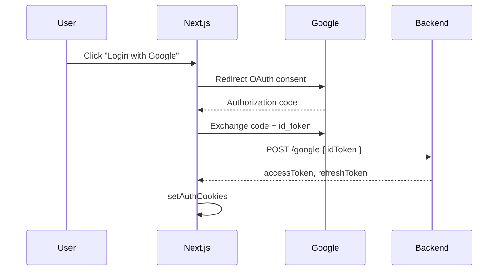

# 7. Authentication — Tổng quan

Tài liệu nền trước khi đọc NextAuth v5 và pattern JWT của Nova Shop.

---

## 7.1 Authentication vs Authorization

| | Authentication (AuthN) | Authorization (AuthZ) |
|---|------------------------|------------------------|
| Câu hỏi | **Ai** đang truy cập? | **Được phép** làm gì? |
| Ví dụ | Login email/password | Role `admin` mới xóa sản phẩm |
| Nova Shop | NextAuth + JWT cookies | Route `/products` cần session; API backend kiểm tra token |

---

## 7.2 Các mô hình session phổ biến

### Session cookie (server-side session)

- Server lưu session ID; client giữ cookie `sessionId`.
- Thu hồi session dễ (xóa trên server).
- Cần store (Redis, DB).

### JWT (stateless)

- Server ký token chứa claims (`sub`, `exp`, `role`).
- Server không lưu session — verify chữ ký mỗi request.
- Khó revoke trước khi hết hạn (cần blacklist hoặc refresh token ngắn).

### Dual token (access + refresh) — Nova Shop backend

| Token | Thời gian | Dùng cho |
|-------|-----------|----------|
| Access | Ngắn (vài phút–giờ) | Mỗi API request (`Authorization: Bearer`) |
| Refresh | Dài (ngày–tuần) | Lấy access mới qua `POST /token` |

**Lợi ích:** access lộ ít rủi ro; refresh chỉ gửi khi cần renew.

---

## 7.3 Lưu token ở đâu?

| Nơi lưu | Ưu | Nhược |
|---------|-----|-------|
| **HttpOnly cookie** | JS không đọc được → chống XSS đánh cắp token | Cần CSRF protection cho cookie auth |
| localStorage | Dễ dùng SPA | XSS đọc được token |
| Memory only | An toàn hơn localStorage | Mất khi refresh tab |

Nova Shop: `access_token`, `refresh_token` → **HttpOnly cookie** (`setAuthCookies`).

---

## 7.4 OAuth 2.0 / OpenID Connect (Google login)



- **NextAuth** lo phần redirect Google.
- **Backend** verify `id_token`, tạo JWT riêng hệ thống.

---

## 7.5 Credentials login (email/password)

```text
User → form → Server Action signIn("credentials")
  → authorize() → POST /login backend
  → setAuthCookies(access, refresh, userId)
  → NextAuth session { id: email }
```

Backend validate password; frontend **không** lưu password.

---

## 7.6 HTTPS và cookie flags

```ts
cookieStore.set({
  name: "access_token",
  value: tokens.accessToken,
  httpOnly: true,
  secure: process.env.NODE_ENV === "production",
  sameSite: "lax",
  path: "/",
  maxAge: ACCESS_TOKEN_MAX_AGE,
});
```

| Flag | Ý nghĩa |
|------|---------|
| `httpOnly` | Không đọc bằng `document.cookie` |
| `secure` | Chỉ gửi qua HTTPS (production) |
| `sameSite: lax` | Giảm CSRF cross-site POST |
| `maxAge` | Thời gian sống cookie |

---

## 7.7 Logout

```text
signOut() event
  → POST /logout backend (invalidate refresh)
  → clearAuthCookies()
  → NextAuth xóa session JWT
```

Luôn clear cookie client dù backend fail (tránh “zombie session” UI).

---

## 7.8 CSRF — khi nào quan tâm?

- Cookie tự động gửi kèm request → site khác có thể trigger nếu không có SameSite + CSRF token.
- `sameSite: lax` + SameSite API design giảm rủi ro.
- Server Actions Next.js có **origin check** built-in.

---

## 7.9 Zod validation đầu vào login

```ts
const parsed = z
  .object({ email: z.string().email(), password: z.string().min(6) })
  .safeParse(credentials);
```

Validate trước khi gọi API — giảm request rác, message lỗi nhất quán.

---

## 7.10 Env variables auth

```env
AUTH_SECRET=...              # Ký NextAuth JWT (hoặc NEXTAUTH_SECRET)
GOOGLE_CLIENT_ID=...
GOOGLE_CLIENT_SECRET=...
NEXT_PUBLIC_EXTERNAL_API_URL=...
```

`AUTH_SECRET` — bắt buộc production; không commit lên git.

---

## 7.11 Đọc tiếp

- [8. NextAuth v5.md](./8.%20NextAuth%20v5.md) — cấu hình Auth.js
- [9. JWT Cookies va Dual Auth.md](./9.%20JWT%20Cookies%20va%20Dual%20Auth.md) — authFetch, refresh
- [10. Vi du Nova Shop.md](./10.%20Vi%20du%20Nova%20Shop.md) — map file dự án
