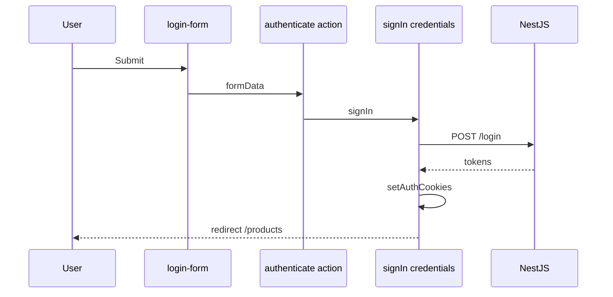

# 8. NextAuth v5 (Auth.js) — Hướng dẫn chi tiết

Cấu hình **Auth.js / NextAuth v5** trong Nova Shop: file structure, providers, callbacks, session JWT.

**Package Nova:** `"next-auth": "5.0.0-beta.29"` — đọc [authjs.dev](https://authjs.dev), không copy tutorial v4.

**Đọc theo thứ tự:** Mục 1–3 (file) → 4–6 (providers) → 7 (callbacks) → 8 (Nova flows) → 9 (FAQ).

**Docs:** [Auth.js Next.js](https://authjs.dev/getting-started/installation?framework=next.js)

---

## Mục lục

1. [NextAuth v5 khác v4 thế nào?](#1-nextauth-v5-khác-v4-thế-nào)
2. [Cấu trúc file trong Nova Shop](#2-cấu-trúc-file-trong-nova-shop)
3. [Export `auth`, `signIn`, `handlers`](#3-export-auth-signin-handlers)
4. [Session strategy: JWT](#4-session-strategy-jwt)
5. [Provider: Credentials](#5-provider-credentials)
6. [Provider: Google OAuth](#6-provider-google-oauth)
7. [Callbacks: `signIn`, `jwt`, `session`, `authorized`](#7-callbacks-signin-jwt-session-authorized)
8. [SessionProvider & `useSession`](#8-sessionprovider--usesession)
9. [Luồng login / logout Nova](#9-luồng-login--logout-nova)
10. [FAQ & bản đồ file](#10-faq--bản-đồ-file)

---

## 1. NextAuth v5 khác v4 thế nào?

| v4 | v5 |
|----|-----|
| `pages/api/auth/[...nextauth].ts` một file lớn | `auth.ts` + `auth.config.ts` |
| `getServerSession` | `await auth()` |
| Docs next-auth.org | authjs.dev |
| Middleware tự viết nhiều | `NextAuth(config).auth` |

---

## 2. Cấu trúc file trong Nova Shop

```text
auth.config.ts     → edge-safe: session, jwt, authorized (middleware)
auth.ts            → providers, signIn callback, events signOut
middleware.ts      → export default NextAuth(authConfig).auth
app/api/auth/[...nextauth]/route.ts  → export { GET, POST } = handlers
app/providers.tsx  → <SessionProvider> (client)
app/lib/actions.ts → authenticate() gọi signIn
```

**Tại sao tách `auth.config`?** Middleware chạy **Edge** — không import module Node nặng từ `auth.ts`.

---

## 3. Export `auth`, `signIn`, `handlers`

```ts
// auth.ts
export const { auth, signIn, signOut, handlers } = NextAuth({
  ...authConfig,
  secret: process.env.AUTH_SECRET ?? process.env.NEXTAUTH_SECRET,
  providers: [ Google(...), Credentials(...) ],
  callbacks: { ...authConfig.callbacks, signIn, jwt, session },
  events: { signOut: async () => { ... } },
});
```

| Export | Dùng khi |
|--------|----------|
| `auth()` | Server Component: `const session = await auth()` |
| `signIn("credentials", {...})` | Server Action login |
| `signOut()` | Đăng xuất |
| `handlers` | Route `/api/auth/*` |

---

## 4. Session strategy: JWT

```ts
// auth.config.ts
session: {
  strategy: "jwt",
  maxAge: 24 * 60 * 60,
  updateAge: 12 * 60 * 60,
},
jwt: { maxAge: 30 * 24 * 60 * 60 },
```

| | JWT session | Database session |
|---|-------------|------------------|
| Lưu ở | Cookie session token (signed) | Bảng `sessions` |
| Revoke | Khó hơn (đợi expiry) | Xóa row |
| Nova | ✅ Không adapter DB trong Next app | |

**Lưu ý:** NextAuth JWT **khác** JWT `access_token` của NestJS — hai hệ song song (file 9).

---

## 5. Provider: Credentials

```ts
Credentials({
  async authorize(credentials) {
    const parsed = z.object({
      email: z.string().email(),
      password: z.string().min(6),
    }).safeParse(credentials);

    if (!parsed.success) return null;

    const response = await login({ email, password }); // POST /login
    await setAuthCookies({
      accessToken: response.accessToken,
      refreshToken: response.refreshToken,
      userId: response.userId,
    });
    return { id: email, name: email };
  },
}),
```

| Bước | Ý nghĩa |
|------|---------|
| `safeParse` | Validate input |
| `login()` | Gọi NestJS |
| `setAuthCookies` | JWT backend cho `authFetch` |
| `return user` | Tạo NextAuth session |
| `return null` | Login fail |

---

## 6. Provider: Google OAuth

```ts
Google({
  clientId: process.env.GOOGLE_CLIENT_ID!,
  clientSecret: process.env.GOOGLE_CLIENT_SECRET!,
  authorization: {
    params: { prompt: "consent", access_type: "offline", response_type: "code" },
  },
}),
```

**Callback `signIn`:**

```ts
async signIn({ user, account }) {
  if (account?.provider === "google" && user.email) {
    const response = await googleAuthAction({ idToken: account.id_token! });
    await setAuthCookies({ ... });
    return true;
  }
  return true;
}
```

Redirect URI Google Console: `{ORIGIN}/api/auth/callback/google`

---

## 7. Callbacks: `signIn`, `jwt`, `session`, `authorized`

### `authorized` — middleware

Xem chi tiết [6. Middleware](./6.%20Middleware.md). Quyết định allow / redirect `/login`.

### `jwt` — gắn data vào token

```ts
async jwt({ token, user, account }) {
  if (account && user) {
    return { ...token, accessToken: account.access_token, expiresAt: ... };
  }
  if (token.expiresAt && Date.now()/1000 > token.expiresAt) return null;
  return token;
}
```

`return null` → force logout.

### `session` — đưa data ra client

```ts
async session({ session, token }) {
  session.accessToken = token.accessToken;
  session.expiresAt = token.expiresAt;
  if (token.sub) session.user.id = token.sub;
  return session;
}
```

**Module augmentation:**

```ts
declare module "next-auth" {
  interface Session {
    accessToken?: string;
    expiresAt?: number;
    nearExpiry?: boolean;
  }
}
```

**Cải thiện Nova:** Callback `jwt`/`session` trùng giữa `auth.ts` và `auth.config.ts` — nên gom một nguồn tránh lệch.

---

## 8. SessionProvider & `useSession`

```tsx
// app/providers.tsx
"use client";
import { SessionProvider } from "next-auth/react";

export default function Providers({ children }) {
  return <SessionProvider>{children}</SessionProvider>;
}
```

```tsx
// navbar.tsx — client
const { data: session } = useSession();
```

**Server không cần Provider** — dùng `await auth()`.

---

## 9. Luồng login / logout Nova

### Login email



### Logout

```ts
events: {
  async signOut() {
    await logout();           // POST /logout NestJS
    await clearAuthCookies();
  },
},
```

---

## 10. FAQ & bản đồ file

### FAQ

**Q: Redirect loop login?**  
Check `authorized` + `pages.signIn` + cookies set sau login.

**Q: `signIn` throw?**  
Redirect nội bộ — catch `AuthError`, rethrow.

**Q: Session null trên server?**  
Thiếu `AUTH_SECRET`.

### Env

```env
AUTH_SECRET=
GOOGLE_CLIENT_ID=
GOOGLE_CLIENT_SECRET=
```

**Tiếp theo:** [9. JWT Dual Auth](./9.%20JWT%20Cookies%20va%20Dual%20Auth.md) · [6. Middleware](./6.%20Middleware.md)
