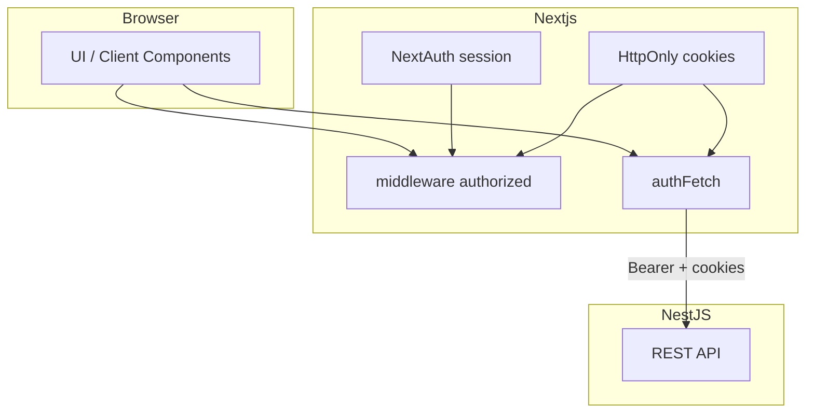
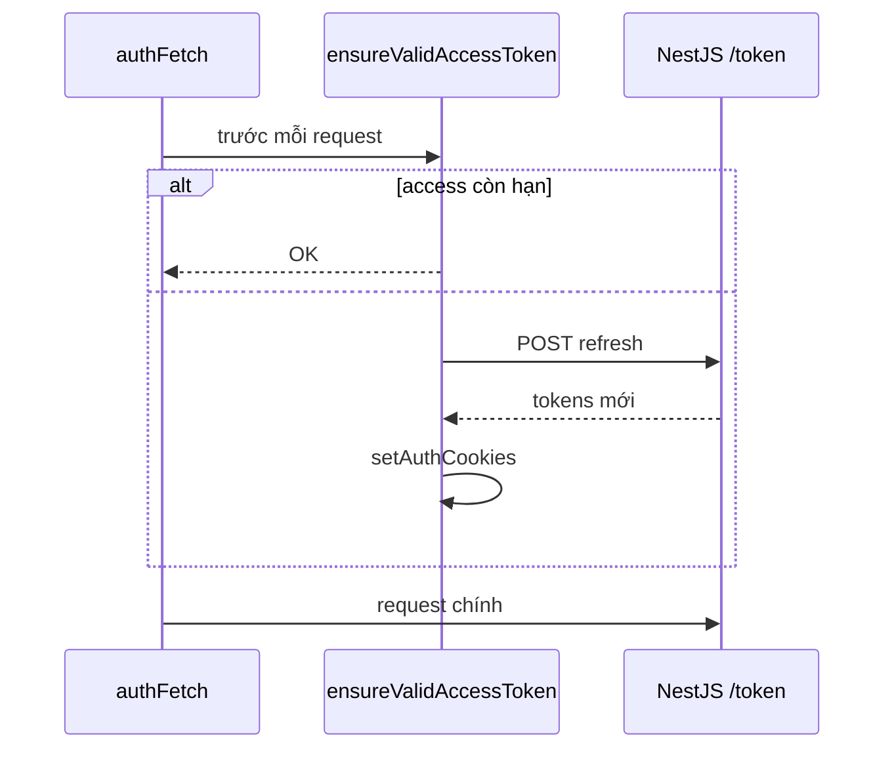

# 9. JWT Cookies & Dual Auth — Hướng dẫn chi tiết (Nova Shop)

Giải thích **tại sao Nova có hai hệ auth** (NextAuth + JWT NestJS), cách **`authFetch` / refresh** hoạt động, và **so sánh best practice**.

**Đọc sau:** [7. Authentication](./7.%20Authentication%20-%20Tong%20quan.md), [8. NextAuth v5](./8.%20NextAuth%20v5.md).

---

## Mục lục

1. [Dual auth là gì?](#1-dual-auth-là-gì)
2. [Sơ đồ tổng thể](#2-sơ-đồ-tổng-thể)
3. [Cookies — tên và vai trò](#3-cookies--tên-và-vai-trò)
4. [`setAuthCookies` / `clearAuthCookies`](#4-setauthcookies--clearauthcookies)
5. [`ensureValidAccessToken` & `refreshTokens`](#5-ensurevalidaccesstoken--refreshtokens)
6. [`authFetch` — wrapper fetch](#6-authfetch--wrapper-fetch)
7. [Middleware + `authFetch` — hai lớp kiểm tra](#7-middleware--authfetch--hai-lớp-kiểm tra)
8. [Contract API NestJS](#8-contract-api-nestjs)
9. [So sánh pattern khác](#9-so-sánh-pattern-khác)
10. [Best practice vs Nova & cải thiện](#10-best-practice-vs-nova--cải-thiện)
11. [FAQ & implement từ đầu](#11-faq--implement-từ-đầu)

---

## 1. Dual auth là gì?

| Hệ | Lưu ở đâu | Phục vụ |
|----|-----------|---------|
| **NextAuth session** | Cookie session JWT (Auth.js) | `useSession`, middleware `auth?.user`, UX login |
| **Backend JWT** | HttpOnly `access_token`, `refresh_token` | `authFetch` → NestJS `Authorization: Bearer` |

**Không trùng nhau** — cùng tồn tại sau login thành công.

```text
User login OK
  → NextAuth: "user đã signIn" (middleware biết)
  → Cookies: "API calls có Bearer" (authFetch biết)
```

---

## 2. Sơ đồ tổng thể



---

## 3. Cookies — tên và vai trò

File: `app/lib/auth-constants.ts`

| Cookie | HttpOnly? | Mục đích |
|--------|-----------|----------|
| `access_token` | ✅ | Bearer gửi NestJS |
| `refresh_token` | ✅ | Lấy access mới qua `/token` |
| `access_expires_at` | ✅ | Unix time hết hạn access |
| `user_id` | ❌ (Nova) | Query cart — **nên** derive từ JWT backend |

---

## 4. `setAuthCookies` / `clearAuthCookies`

### Sau login thành công

```ts
// auth-tokens.ts
await setAuthCookies({
  accessToken: response.accessToken,
  refreshToken: response.refreshToken,
  userId: response.userId,
});
```

Gọi từ:

- `Credentials.authorize`
- `signIn` callback Google

### Flags bảo mật

```ts
httpOnly: true,
secure: process.env.NODE_ENV === "production",
sameSite: "lax",
maxAge: ACCESS_TOKEN_MAX_AGE,
```

### Logout

```ts
events: {
  async signOut() {
    await logout();        // POST /logout + refresh body
    await clearAuthCookies();
  },
}
```

Clear cookie dù backend fail — tránh UI “zombie logged in”.

---

## 5. `ensureValidAccessToken` & `refreshTokens`

### Vấn đề

Access token **hết hạn** giữa chừng — user vẫn có `refresh_token`.

### Giải pháp Nova

```ts
export async function ensureValidAccessToken(): Promise<boolean> {
  const access = cookies().get(ACCESS_TOKEN_COOKIE)?.value;
  const expiresAt = cookies().get(ACCESS_EXPIRES_COOKIE)?.value;

  if (access && !isAccessTokenExpired(expiresAt)) return true;
  return refreshTokens();
}

export async function refreshTokens(): Promise<boolean> {
  const refresh = cookies().get(REFRESH_TOKEN_COOKIE)?.value;
  if (!refresh) return false;

  const res = await fetch(`${API}/token`, {
    method: "POST",
    body: JSON.stringify({ refreshToken: refresh }),
  });
  if (!res.ok) return false;

  const data = await res.json();
  await setAuthCookies(data);
  return true;
}
```



---

## 6. `authFetch` — wrapper fetch

File: `app/lib/api-client.ts`

```ts
export async function authFetch(url: string, init?: RequestInit) {
  await ensureValidAccessToken();

  let response = await fetch(url, {
    ...init,
    headers: await getAuthHeaders(extra),
  });

  if (response.status === 401) {
    if (await refreshTokens()) {
      response = await fetch(url, { ...init, headers: await getAuthHeaders(extra) });
    }
  }
  return response;
}
```

| Bước | Việc |
|------|------|
| 1 | Proactive refresh nếu access sắp/hết hạn |
| 2 | Gắn `Authorization: Bearer` + forward cookies |
| 3 | 401 → refresh một lần → retry |

**Services** (`cart.ts`, `products.ts`) luôn dùng `authFetch` cho API cần login.

---

## 7. Middleware + `authFetch` — hai lớp kiểm tra

| Tầng | Câu hỏi | Fail thì |
|------|---------|----------|
| Middleware | Có session + cookie hợp lệ để **vào page**? | Redirect `/login` |
| `authFetch` | Token còn gọi được API? | `unauthorized()` / empty |

**Scenario:** Middleware pass (còn refresh) nhưng access hết hạn → `ensureValidAccessToken` refresh trước fetch.

**Scenario:** Refresh cũng hết hạn → `getProducts` → 401 → `unauthorized()`.

---

## 8. Contract API NestJS

| Method | Path | Body |
|--------|------|------|
| POST | `/login` | `{ email, password }` |
| POST | `/google` | `{ idToken }` |
| POST | `/token` | `{ refreshToken }` |
| POST | `/logout` | `{ refreshToken }` + Bearer |
| GET | `/products` | Bearer |
| GET | `/cart?userId=` | Bearer — **nên** bỏ query, lấy từ JWT |

---

## 9. So sánh pattern khác

| Pattern | Mô tả | Nova |
|---------|--------|------|
| Chỉ NextAuth | API proxy trong Next, session làm auth | ❌ API riêng |
| Chỉ JWT localStorage | SPA thuần | ❌ |
| **Dual auth (BFF)** | NextAuth UX + backend JWT | ✅ |
| Session chỉ server | Một cookie session, API tin Next | Gần giống nếu proxy hết |

---

## 10. Best practice vs Nova & cải thiện

| Best practice | Nova | Đánh giá |
|---------------|------|----------|
| HttpOnly cookies | ✅ | ✅ |
| Short access + refresh | ✅ | ✅ |
| Refresh trước request | `ensureValidAccessToken` | ✅ Tốt |
| Retry 401 một lần | ✅ | ✅ |
| Identity từ JWT server-side | `userId` query param | ⚠️ Sửa backend |
| Navbar client `getCart` | Có | ⚠️ Prefetch layout server |
| Logout revoke refresh | `POST /logout` | ✅ |

---

## 11. FAQ & implement từ đầu

### FAQ

**Q: Chỉ cần Bearer, bỏ NextAuth?**  
Mất `useSession`, middleware Auth.js — phải tự viết nhiều hơn.

**Q: `authFetch` chạy client được không?**  
Chỉ qua Server Action / Server Component — cookies server-only.

**Q: Dual auth có worth it?**  
Có khi API NestJS đã có JWT; greenfield nhỏ có thể đơn giản hóa.

### Thứ tự implement từ đầu

1. Backend: `/login`, `/token`, `/logout`
2. `setAuthCookies` / `clearAuthCookies`
3. `authFetch` + `refreshTokens`
4. NextAuth Credentials + `setAuthCookies` trong `authorize`
5. Middleware `authorized` check cookies
6. Google provider + `POST /google`
7. Test: login → API → xóa access cookie → reload → auto refresh

**Tiếp theo:** [10. Vi du Nova Shop](./10.%20Vi%20du%20Nova%20Shop.md) · [5. Data Fetching](./5.%20Data%20Fetching%20va%20Cache.md)
