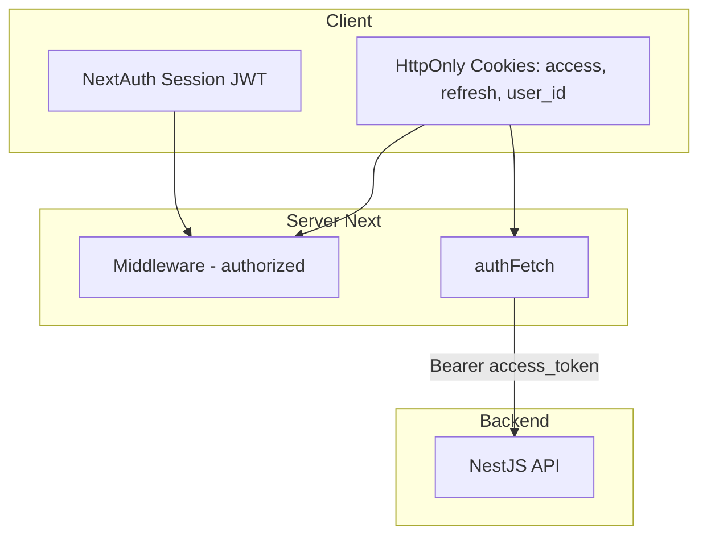

# 9. JWT Cookies & Dual Auth Pattern (Nova Shop)

Nova Shop kết hợp **NextAuth session** và **JWT backend trong HttpOnly cookies**. Đây là pattern phổ biến khi frontend Next.js + API riêng (NestJS, Django, …).

---

## 9.1 Hai lớp auth song song



| Lớp | Mục đích |
|-----|----------|
| NextAuth | UX login, `useSession`, middleware `auth?.user` |
| Backend JWT cookies | Gọi API thật (`/products`, `/cart`) |

---

## 9.2 Cookie names & constants

```ts
// app/lib/auth-constants.ts (khái niệm)
ACCESS_TOKEN_COOKIE = "access_token"
REFRESH_TOKEN_COOKIE = "refresh_token"
ACCESS_EXPIRES_COOKIE = "access_expires_at"  // unix timestamp
USER_ID_COOKIE = "user_id"
```

---

## 9.3 setAuthCookies — sau login thành công

```ts
export async function setAuthCookies(tokens: TokenPair) {
  const cookieStore = await cookies();
  const expiresAt = Math.floor(Date.now() / 1000) + ACCESS_TOKEN_MAX_AGE;

  cookieStore.set({
    name: ACCESS_TOKEN_COOKIE,
    value: tokens.accessToken,
    httpOnly: true,
    secure: isProd,
    sameSite: "lax",
    maxAge: ACCESS_TOKEN_MAX_AGE,
  });
  // refresh_token, access_expires_at, user_id ...
}
```

Gọi từ:

- `Credentials.authorize`
- `signIn` callback Google

---

## 9.4 ensureValidAccessToken & refreshTokens

```ts
export async function ensureValidAccessToken(): Promise<boolean> {
  const accessToken = cookies().get(ACCESS_TOKEN_COOKIE)?.value;
  const expiresAt = cookies().get(ACCESS_EXPIRES_COOKIE)?.value;

  if (accessToken && !isAccessTokenExpired(expiresAt)) return true;
  return refreshTokens();
}

export async function refreshTokens(): Promise<boolean> {
  const refreshToken = cookies().get(REFRESH_TOKEN_COOKIE)?.value;
  if (!refreshToken) return false;

  const res = await fetch(`${API}/token`, {
    method: "POST",
    body: JSON.stringify({ refreshToken }),
  });
  if (!res.ok) return false;

  const data = await res.json();
  await setAuthCookies(data);
  return true;
}
```

**Mọi** `authFetch` gọi `ensureValidAccessToken()` trước — transparent refresh.

---

## 9.5 authFetch — wrapper fetch

```ts
export async function authFetch(url: string, init?: RequestInit) {
  await ensureValidAccessToken();

  let response = await fetch(url, {
    ...init,
    headers: await getAuthHeaders(extra),
  });

  if (response.status === 401) {
    if (await refreshTokens()) {
      response = await fetch(url, { ...init, headers: await getAuthHeaders(extra) });
    }
  }
  return response;
}

export async function getAuthHeaders() {
  const accessToken = cookies().get("access_token")?.value;
  return {
    Authorization: accessToken ? `Bearer ${accessToken}` : "",
    Cookie: cookieStore.toString(), // nếu backend đọc cookie
  };
}
```

---

## 9.6 Middleware validation logic

```ts
const hasValidSession =
  isLoggedIn &&
  ((hasAccessToken && !accessExpired) || hasRefreshToken);
```

| Trạng thái | Kết quả |
|------------|---------|
| NextAuth logged in + access OK | ✅ Vào `/products` |
| Access hết hạn + còn refresh | ✅ Vào (refresh lazy khi authFetch) |
| Không refresh | ❌ Redirect `/login` |

---

## 9.7 Backend endpoints auth (contract)

| Method | Path | Body / Header |
|--------|------|----------------|
| POST | `/login` | `{ email, password }` → tokens |
| POST | `/google` | `{ idToken }` → tokens |
| POST | `/token` | `{ refreshToken }` → tokens mới |
| POST | `/logout` | `{ refreshToken }` + Bearer |
| GET | `/products` | Bearer (optional/public tùy API) |
| GET | `/cart?userId=` | Bearer |

Frontend **không** hardcode logic business — chỉ gọi contract.

---

## 9.8 unauthorized() vs middleware redirect

```ts
// services/cart.ts
if (res.status === 401) unauthorized();
```

- **Middleware:** chặn trước khi render page.
- **unauthorized():** khi page đã chạy nhưng API trả 401 (token revoke giữa chừng).

---

## 9.9 Client-side cart badge (ngoài auth)

```ts
// cart-events.ts
export function syncCartBadge(count: number) {
  localStorage.setItem("cartItemsCount", count.toString());
  window.dispatchEvent(new CustomEvent("cart-updated", { detail: { count } }));
}
```

Không liên quan JWT — UX navbar cập nhật ngay sau Server Action.

---

## 9.10 Logout đầy đủ

```ts
events: {
  async signOut() {
    await fetch(`${API}/logout`, {
      method: "POST",
      headers: { Authorization: `Bearer ${accessToken}` },
      body: JSON.stringify({ refreshToken }),
    });
    await clearAuthCookies();
  },
},
```

---

## 9.11 So sánh pattern khác

| Pattern | Mô tả | Nova Shop |
|---------|--------|-----------|
| Chỉ NextAuth | API Routes proxy + session | Không — API NestJS riêng |
| Chỉ JWT localStorage | SPA thuần | Không — dùng HttpOnly |
| **Dual auth** | NextAuth + backend JWT | ✅ |
| BFF session only | Next.js giữ session, API tin server | Gần giống (cookie server-side) |

---

## 9.12 Security checklist

- [ ] `AUTH_SECRET` mạnh, không leak
- [ ] Access token TTL ngắn
- [ ] Refresh rotation (backend nên implement)
- [ ] `secure: true` trên production
- [ ] Không log token ra console production
- [ ] `userId` từ cookie — backend nên verify userId khớp token, không chỉ query param

---

## 9.13 Implement từ đầu — thứ tự

1. Backend: `/login`, `/token`, `/logout` trả access + refresh.
2. `setAuthCookies` / `clearAuthCookies`.
3. `authFetch` + `refreshTokens`.
4. NextAuth Credentials gọi login + set cookies.
5. Middleware `authorized` check cookies.
6. Google provider + `/google` backend.
7. Test: login → gọi API → đợi access hết hạn → refresh tự động.
