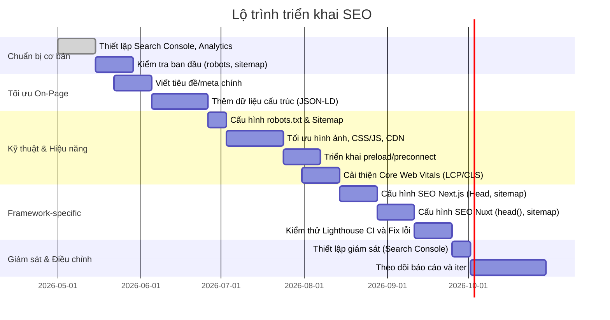

# Tóm tắt và Nguyên tắc chung

SEO (Search Engine Optimization) là tập hợp các kỹ thuật giúp công cụ tìm kiếm hiểu và xếp hạng trang web của bạn tốt hơn. Việc tối ưu SEO bao gồm **on-page SEO** và **technical SEO**, cũng như **performance optimization** và **user experience**.

Trong phần tiếp theo, chúng ta sẽ đi chi tiết từng khía cạnh: cấu trúc HTML/meta, dữ liệu có cấu trúc (JSON-LD), robots/sitemap, hiệu năng, khả năng truy cập (accessibility).

```mermaid
graph LR
  A[Robots.txt & Sitemap] -->|Xác định| B[URL được phép và ưu tiên]
  B --> C[Tải trang (Fetch)]
  C --> D{Trang tĩnh hoặc tải bằng JS}
  D --> E[Tạo nội dung (SSR/CSR rendering)]
  E --> F[Thêm vào chỉ mục (Indexing)]
  F --> G[Người dùng tìm kiếm và xem kết quả]
```

— trong đó **robots.txt** và **sitemap.xml** định hướng cho crawler các URL nào được phép thu thập, sau đó Google sẽ tải trang, xử lý HTML/JS, rồi lập chỉ mục nội dung.

## Tối ưu On-Page và Nội dung

- **Thẻ tiêu đề (Title) và mô tả (Meta description)**: Mỗi trang cần có thẻ `<title>` và `<meta name="description">` duy nhất, súc tích và đúng chủ đề. Google sử dụng các thẻ này để hiển thị trong kết quả tìm kiếm.
  ```html
  <title>Tiêu đề bài viết - Tên trang</title>
  <meta name="description" content="Mô tả ngắn gọn nội dung trang, khái quát ý chính và chứa từ khóa chính">
  ```
  Không nên nhồi nhét từ khóa; nội dung mô tả cần hấp dẫn để tăng tỷ lệ click. Công cụ Lighthouse sẽ báo thiếu thẻ tiêu đề hoặc mô tả trên trang.

- **Thẻ Robots**: Sử dụng `<meta name="robots">` để điều khiển crawl/index. Mặc định Google coi trang là `index, follow`. Nếu cần *không cho phép lập chỉ mục*, dùng `noindex`.
  ```html
  <meta name="robots" content="noindex,nofollow">
  ```
  Nếu cần cấu hình qua HTTP header, có thể dùng `X-Robots-Tag`. Google hỗ trợ `robots` trên HTTP header, hữu ích với các file không phải HTML.

- **Canonical và Hreflang**: Dùng `<link rel="canonical" href="URL">` để đánh dấu URL gốc trên các trang tương tự (ví dụ bản phân trang, bản in, URL có tham số). Canonical giúp chuẩn hóa URL và tránh nội dung trùng lặp.
  ```html
  <link rel="alternate" href="https://example.com/vi" hreflang="vi">
  <link rel="alternate" href="https://example.com/en" hreflang="en">
  ```

- **Dữ liệu có cấu trúc (JSON-LD)**: Áp dụng Schema.org để Google hiểu nội dung đặc thù (Bài báo, Sản phẩm, Recipe, Sự kiện, Sách, Breadcrumb, v.v). JSON-LD được khuyến nghị vì dễ triển khai và không can thiệp vào HTML.
  ```html
  <script type="application/ld+json">
  {
    "@context": "https://schema.org",
    "@type": "Article",
    "headline": "Tiêu đề bài viết",
    "datePublished": "2026-05-01",
    "author": { "@type": "Person", "name": "Tên tác giả" },
    "publisher": { "@type": "Organization", "name": "Tên tổ chức",
                   "logo": { "@type": "ImageObject", "url": "https://example.com/logo.png" } },
    "image": ["https://example.com/img1.jpg","https://example.com/img2.jpg"],
    "description": "Mô tả ngắn về nội dung bài viết"
  }
  </script>
  ```
  Theo Google, việc thêm **structured data** giúp kết quả tìm kiếm phong phú hơn (rich results) và có thể tăng tỉ lệ CTR. Tuy nhiên, phải tuân quy tắc schema.org chặt chẽ để Google công nhận.

- **Thẻ HTML cơ bản và Semantic**: Sử dụng đúng `<h1>...<h6>` cho tiêu đề và phân cấp nội dung; không bỏ qua h1. Các thẻ `<nav>`, `<header>`, `<main>`, `<article>`, `<footer>` giúp crawlers hiểu cấu trúc trang.
  ```jsx
  import Head from 'next/head';
  <Head>
    <title>Nội dung tiêu đề</title>
    <meta name="description" content="Mô tả trang"/>
  </Head>
  ```
  Còn trong Nuxt dùng `head()` trong trang hoặc nuxt.config.js để đặt meta.

- **Hình ảnh và media**: Mỗi ảnh nên có `alt` mô tả ngắn, súc tích về nội dung ảnh, hữu ích cho người dùng không thấy được ảnh và cho SEO.
  ```html
  
  ```
  Việc lazy-load (thuộc tính `loading="lazy"`) ảnh ngoài vùng nhìn giúp cải thiện tốc độ, nhưng cần dùng kèm fallback nếu trang nặng JS (vì Googlebot có thể bỏ qua lazy-load nếu không có JS).

## SEO Kỹ thuật (Technical SEO)

- **robots.txt**: Tập tin robots.txt ở thư mục gốc cho biết bot nào được phép truy cập URL nào. Ví dụ:
  ```plaintext
  User-Agent: *
  Allow: /
  Disallow: /private/
  Sitemap: https://example.com/sitemap.xml
  ``` 
  Đặt `Sitemap:` trong robots.txt để bot tự động phát hiện sitemap. Theo Next.js 13+, có thể tạo `app/robots.txt` hoặc `app/robots.ts` để tự sinh.
  ```ts
  // app/robots.ts
  import type { MetadataRoute } from 'next';
  export default function robots(): MetadataRoute.Robots {
    return {
      rules: { userAgent: '*', allow: '/', disallow: '/private/' },
      sitemap: 'https://example.com/sitemap.xml',
    }
  }
  ```
  Các quy tắc robots chỉ huy bot: ví dụ `User-agent: Googlebot` để tùy chỉnh riêng cho Google. Lưu ý: robots.txt chỉ kiểm soát *thu thập* (crawl); nếu một URL đã được index từ liên kết khác, robots.txt không ngăn nó xuất hiện trong kết quả tìm kiếm.

- **Sitemap.xml**: Tạo sitemap (XML) liệt kê tất cả URL quan trọng cùng metadata (lastmod, changefreq, priority). Nên đặt ở gốc (ví dụ `/sitemap.xml`) và khai báo trong robots.txt.
  ```xml
  <?xml version="1.0" encoding="UTF-8"?>
  <urlset xmlns="http://www.sitemaps.org/schemas/sitemap/0.9">
    <url>
      <loc>https://example.com/</loc>
      <lastmod>2026-05-08</lastmod>
      <changefreq>weekly</changefreq>
      <priority>1.0</priority>
    </url>
    <url>
      <loc>https://example.com/gioi-thieu</loc>
      <lastmod>2026-05-01</lastmod>
      <changefreq>monthly</changefreq>
      <priority>0.8</priority>
    </url>
    <!-- thêm các URL khác -->
  </urlset>
  ```
  Với Next.js và app-router, có thể dùng `app/sitemap.ts` xuất hàm trả về mảng URLs và Next tự sinh XML. Ví dụ Next.js:
  ```ts
  // app/sitemap.ts (Next 13)
  import type { MetadataRoute } from 'next';
  export default function sitemap(): MetadataRoute.Sitemap {
    return [
      { url: 'https://example.com/', lastModified: new Date(), changeFrequency: 'weekly', priority: 1 },
      { url: 'https://example.com/about', lastModified: new Date(), changeFrequency: 'monthly', priority: 0.8 },
      // ...
    ];
  }
  ```
  Output là `sitemap.xml` chứa `<urlset>` tương tự. Ngoài URL, sitemap cũng hỗ trợ khai báo `<image>` và `<video>` cho ảnh/video nếu cần.

- **Chuyển hướng (Redirects)**: Dùng chuyển hướng 301 khi thay đổi URL hoặc di chuyển trang để truyền quyền (Link juice) sang URL mới. Tránh chuyển hướng chuỗi dài.
  ```htaccess
  RewriteEngine On
  RewriteRule ^(.*)/$ /$1 [R=301,L]
  ```
  Hoặc Node/Express:
  ```js
  app.get('/old-page', (req, res) => {
    res.redirect(301, '/new-page');
  });
  ```
  Điều này báo cho Google rằng URL cũ đã chuyển vĩnh viễn sang URL mới. Ngoài ra, tránh **soft 404** (trả 200 cho trang lỗi) bằng cách đảm bảo trang lỗi trả mã 404/410.

- **HTTP Headers**: Đặt header đúng (Content-Type, encoding UTF-8). Sử dụng header `Cache-Control` để chỉ định cache: ví dụ với tài nguyên tĩnh có tên chứa hash, dùng `Cache-Control: max-age=31536000, immutable`; với HTML động, dùng `Cache-Control: max-age=0, must-revalidate`.

- **Tốc độ server**: Hãy đảm bảo tốc độ phản hồi (Time to First Byte thấp). Có thể dùng HTTP/2 hoặc HTTP/3 (QUIC) trên server để giảm độ trễ kết nối và cho phép multiplexing.

## Tối ưu Hiệu năng và UX

Hiệu năng trang web tác động gián tiếp đến SEO qua trải nghiệm người dùng (Core Web Vitals). Các kỹ thuật sau đây rất quan trọng: 

- **HTTP/2 hoặc HTTP/3**: Giao thức mới cho phép nhiều yêu cầu chia sẻ một kết nối TLS, giảm độ trễ so với HTTP/1.1. Nếu máy chủ hoặc CDN hỗ trợ, hãy kích hoạt.

- **CDN (Content Delivery Network)**: Đưa nội dung tĩnh (ảnh, CSS, JS) đến gần người dùng hơn, giảm thời gian tải. Ví dụ sử dụng Cloudflare, AWS CloudFront, v.v.

- **Cache-Control**: Đặt header `Cache-Control` hợp lý cho tài nguyên. Ví dụ, CSS/JS/hình ảnh có tên chứa hash có thể gán `max-age=31536000, immutable`, trong khi HTML động cần `no-cache` hoặc `max-age` ngắn.

- **Critical CSS và Non-blocking CSS**: Chỉ để CSS quan trọng (cho phần hiển thị đầu trang) nằm trong `<head>` và tải trực tiếp, phần CSS còn lại có thể load bất đồng bộ.

- **Preconnect, Preload, Prefetch (Resource Hints)**: Sử dụng `<link rel="preconnect">` để khởi tạo trước kết nối tới domain quan trọng (ví dụ Google Fonts, Analytics).
  ```html
  <link rel="preconnect" href="https://fonts.gstatic.com" crossorigin>
  <link rel="preload" href="/fonts/myfont.woff2" as="font" type="font/woff2" crossorigin>
  ```
  Các kỹ thuật này giảm đáng kể thời gian LCP nếu dùng hợp lý. Lưu ý không lạm dụng preload quá nhiều (có thể gây lãng phí băng thông).

- **Nén và tối ưu ảnh**: Giảm kích thước hình ảnh bằng WebP/AVIF hoặc nén (JPEG/PNG). Dùng thẻ `<picture>` với nguồn khác nhau cho responsive. Ví dụ:
  ```html
  <picture>
    <source type="image/webp" srcset="anh-1.webp 1x, anh-2.webp 2x">
    <source type="image/jpeg" srcset="anh-1.jpg 1x, anh-2.jpg 2x">
    
  </picture>
  ```
  Ngoài ra, lazy loading đã nêu ở trên giúp giảm tải khi có nhiều ảnh.  

- **Chia bundle và Code splitting**: Với ứng dụng JS lớn (React/Vue), tách mã thành các chunk nhỏ để tải trang nhanh hơn. Ví dụ Next.js tự động chia page-level chunks. Vue/Nuxt hỗ trợ dynamic imports.

- **Kiểm tra Core Web Vitals (LCP, FID, CLS)**: Dùng [Lighthouse](https://developers.google.com/web/tools/lighthouse) (DevTools hoặc CI) hoặc [PageSpeed Insights](https://pagespeed.web.dev/) để đo lường.

- **Lazy Loading ngoài vùng nhìn (Lazy hydration)**: Với SPAs, chỉ render JavaScript ở phía client nếu thực sự cần. Tuy nhiên, nếu lazy-load cả nội dung quan trọng (above-the-fold), cần đảm bảo bot có thể access nó qua static HTML.

Bảng so sánh dưới đây tóm tắt một số kỹ thuật/tài nguyên hiệu năng:

| Kỹ thuật                  | Công dụng                          | Ưu điểm                                  | Nhược điểm/Khó khăn               |
|---------------------------|------------------------------------|------------------------------------------|-----------------------------------|
| **HTTP/2 / HTTP/3**       | Nâng cấp giao thức truyền tải       | Giảm độ trễ, tải đồng thời nhiều kết nối | Yêu cầu máy chủ hỗ trợ HTTPS      |
| **CDN**                   | Phân phối tài nguyên toàn cầu       | Giảm độ trễ địa lý, khả năng chịu tải    | Chi phí, quản lý cache phức tạp   |
| **Preconnect / DNS-prefetch** | Khởi tạo sớm kết nối & DNS    | Giảm chậm trễ DNS/TLS cho domain quan trọng | Cần biết trước dịch vụ dùng nhiều |
| **Preload / Pre-fetch**   | Ưu tiên tải tài nguyên quan trọng   | Cải thiện LCP (ảnh, font, CSS)           | Lãng phí băng thông nếu lạm dụng  |
| **Bundle Splitting**      | Tách mã JS/CSS thành chunk nhỏ     | Giảm tải ban đầu, tốc độ tải trang nhanh | Cấu hình phức tạp, phải quản lý cache |
| **Lazy Loading**          | Tải tài nguyên ngoài màn hình khi cần | Giảm tài nguyên tải ban đầu            | Cần cung cấp nội dung fallback cho SEO |
| **Critical CSS inlining** | Nhúng CSS quan trọng trực tiếp       | Loại bỏ render-blocking CSS ban đầu    | Kích thước trang tăng, khó duy trì |
| **Cache-Control Header**  | Quy định bộ nhớ đệm trình duyệt     | Giảm yêu cầu lặp lại, tăng tốc reload    | Cần cache-busting khi thay đổi tài nguyên |

## Khả năng truy cập (Accessibility) và UX

SEO không chỉ là máy móc: trải nghiệm người dùng (UX) và khả năng tiếp cận đều ảnh hưởng gián tiếp đến SEO. Google ưu tiên trang thân thiện di động và khả năng tiếp cận cao.

- **Thẻ alt và ARIA**: Như đã nói, `alt` quan trọng cho hình ảnh. Ngoài ra, dùng các thuộc tính ARIA/chức năng semantic khi cần (ví dụ thêm `role="navigation"` cho navbar, `aria-label` cho icon-only buttons).

- **Tiêu đề (Heading)**: Chỉ dùng một `<h1>` cho trang (tiêu đề chính), các mục nhỏ dùng `<h2>`, `<h3>`... theo trình tự. Thẻ heading giúp Google hiểu chủ đề và cấu trúc nội dung.

- **Responsive và thân thiện di động**: Đặt `<meta name="viewport" content="width=device-width, initial-scale=1">` để Google xác nhận trang thân thiện di động. Mobile-first indexing là mặc định của Google.

- **UX và tương tác**: Tốc độ load nhanh và tương tác mượt là yếu tố giữ chân người dùng. Đảm bảo các nút/đường link có kích thước đủ lớn để bấm dễ dàng (tối thiểu 48x48px).

## Hướng dẫn theo Framework / CMS

### React / Next.js

- **Server-side Rendering (SSR) & Static Generation (SSG)**: Next.js hỗ trợ cả SSR (trả HTML đã render từ server) và SSG (build tại thời gian triển khai). Để SEO tốt, nên dùng SSR/SSG thay vì pure CSR.
  ```jsx
  import Head from 'next/head';
  export default function Page() {
    return (
      <>
        <Head>
          <title>Tiêu đề trang</title>
          <meta name="description" content="Mô tả trang"/>
          <link rel="canonical" href="https://example.com/page" />
        </Head>
        <h1>Xin chào SEO</h1>
        {/* ... */}
      </>
    );
  }
  ```
  (Next.js 13 App Router cho phép tạo `app/page.tsx` cùng `export const metadata = { title: ..., description: ..., alternates: { canonical: '...' }}`.)

- **Robots.txt & Sitemap**: Next.js 13 có sẵn support robots/sitemap. Đặt `app/robots.txt` hoặc `app/robots.ts` để tạo robots. Đặt `app/sitemap.xml` hoặc `app/sitemap.ts` để tạo sitemap.

- **Image Optimization**: Dùng `<Image>` component của Next.js (kể từ Next 10) để tự động nén ảnh và lazy-load. Thiết lập độ phân giải srcset. Ví dụ:
  ```jsx
  import Image from 'next/image';
  <Image src="/cat.jpg" width={800} height={600} alt="Mèo dễ thương"/>
  ```

- **Tiếp cận / Head**: Dùng `next/head` đảm bảo meta tải trong head; dùng `key` prop nếu lặp. Theo tài liệu, `<meta name="robots">` là chỉ thị bắt buộc và `<link rel="canonical">` nên có trong mọi trang.

### Vue / Nuxt.js

- **Universal Mode (SSR)**: Luôn chạy Nuxt ở chế độ `universal` (SSR) thay vì SPA, vì SSR render trước nội dung giúp bot index đầy đủ. Ví dụ trong `nuxt.config.js`: `mode: 'universal'`.

- **Meta Tags**: Nuxt 2 dùng `head()` trong component/trang hoặc `nuxt.config.js` để định nghĩa `title`, `meta`, `link`, `script`. Ví dụ trong một trang:
  ```js
  export default {
    head() {
      return {
        title: 'Tiêu đề về chúng tôi',
        meta: [
          { name: 'description', content: 'Mô tả trang về chúng tôi' }
        ],
        link: [
          { rel: 'canonical', href: 'https://example.com/about' }
        ]
      }
    }
  }
  ```
  Nuxt 3 (với Composition API) có thể dùng `useHead()` hoặc config `nuxt.config.ts` tương tự. 

- **Sitemap/robots**: Dùng module [@nuxtjs/sitemap](https://www.npmjs.com/package/@nuxtjs/sitemap) để sinh sitemap tự động (ví dụ cài: `yarn add @nuxtjs/sitemap` và thêm vào `modules` trong config).

- **Lazy Loading**: Dùng `nuxt/image` để tối ưu ảnh hoặc thuộc tính `loading="lazy"`. Nuxt cũng hỗ trợ dynamic imports cho thành phần (code splitting). 

### Node.js / Express (Server-rendered)

- **SSR bằng Template**: Với Express, nếu dùng view engine (EJS, Pug...), bạn trả HTML hoàn chỉnh. Ví dụ EJS:
  ```html
  <title><%= title %></title>
  <meta name="description" content="<%= description %>">
  ```
  Trong router:
  ```js
  app.get('/', (req, res) => {
    res.render('index', { title: 'Trang chủ', description: 'Mô tả trang chủ' });
  });
  ```
  Đảm bảo đặt các thẻ meta trong layout chung. Nếu không dùng template, bạn có thể sử dụng server-side React (Next.js) hoặc Vue SSR cho Node.  

- **Sitemap/robots**: Với Express, đơn giản đặt file `robots.txt` ở thư mục public, hoặc tự tạo endpoint như:
  ```js
  app.get('/robots.txt', (req, res) => {
    res.type('text/plain');
    res.send('User-agent: *\nDisallow: /admin/');
  });
  ```
  Tương tự với `/sitemap.xml`. Có thể dùng gói [express-sitemap-xml](https://www.npmjs.com/package/express-sitemap-xml) để tự động. 

### PHP (Server-rendered, Ví dụ WordPress)

- **Template PHP**: Chèn meta trong theme PHP. Ví dụ trong header.php:
  ```php
  <title><?php echo esc_html(get_the_title()); ?></title>
  <meta name="description" content="<?php echo esc_attr(get_the_excerpt()); ?>">
  ```
  Nhiều CMS (WordPress, Joomla) có plugin SEO (Yoast, All in One SEO) để tự động thêm meta, sitemap. WordPress 5.5+ tự tạo sitemap `wp-sitemap.xml`. 

- **Sitemap/robots**: WordPress dynamic tạo robots.txt (truy cập `/robots.txt`). Đảm bảo nó chứa `Sitemap: https://example.com/sitemap_index.xml`. Hoặc dùng plugin để tuỳ chỉnh. 

## Kiểm thử tự động và CI

- **Lighthouse CI & Audit Tools**: Sử dụng [Lighthouse CI](https://github.com/GoogleChrome/lighthouse-ci) của Google trong pipeline để chạy kiểm tra hiệu năng, accessibility, SEO mỗi lần commit hoặc PR.

- **Unit/Integration Tests**: Có thể viết tests bằng Jest, Mocha, hoặc Cypress/Playwright để assert các trang có `<title>`, `<meta name="description">`, canonical, các thẻ heading đúng chuẩn.

- **Lint/CI SEO**: Áp dụng eslint-plugin dành cho SEO (như [eslint-plugin-jsx-a11y] kiểm ARIA) và kiểm tra broken links, sitemap hợp lệ. Chạy `npm run audit` hoặc scripts CI để validate.

## Triển khai và Giám sát

- **Search Console / Analytics**: Đăng ký trang vào Google Search Console để theo dõi tình trạng index (Coverage), hiệu suất tìm kiếm (bao nhiêu lượt hiển thị, CTR mỗi từ khóa). Google Analytics 4 cung cấp dữ liệu user behavior.

- **Log & Error Monitoring**: Kiểm tra logs server để xem bot Google (Googlebot) có bị block không (HTTP 200 cho bot). Dùng tool như Loggly hoặc Sentry để phát hiện lỗi server (5xx errors).

- **Cảnh báo và Dashboards**: Dùng PagerDuty/Sentry báo lỗi khi trang lỗi, hoặc setup Dashboard Core Web Vitals (CrUX data) trong Search Console. Theo dõi Lighthouse/Benchmarks qua thời gian.

- **Thẻ meta Google Site Verification**: Để xác minh Search Console, thêm meta `<meta name="google-site-verification" content="...">` vào trang chủ, hoặc dùng DNS verify.

## Kiểm tra và Roadmap Triển khai

**Checklist Triển khai SEO** cho dự án nhỏ/ vừa: 
1. **Chuẩn bị môi trường**: Kết nối site với Google Search Console & Analytics. Đảm bảo HTTPS. Xác định các URL chính cần tối ưu (trang chủ, danh mục, bài viết chính).
2. **On-page**: Viết tiêu đề, mô tả, nội dung chất lượng cho mỗi trang. Đảm bảo `<h1>` chứa từ khoá chính, các heading con rõ ràng. 
3. **Thẻ HTML quan trọng**: Thêm `<meta name="robots">`, `<meta charset>`, `<meta name="viewport">`. Đặt `<link rel="canonical">` cho các trang tương tự. 
4. **Dữ liệu cấu trúc**: Triển khai JSON-LD (Article, Breadcrumb, Organization, v.v) cho các nội dung. Kiểm thử với Rich Results Test.
5. **Robots & Sitemap**: Tạo robots.txt và sitemap.xml (với URL cần index). Submit lên Search Console. Cấu hình trong framework (ví dụ Next.js `app/robots.ts`, `app/sitemap.ts`).
6. **Hiệu năng cơ bản**: Đảm bảo trang tải tốt mobile (responsive, `<meta viewport>`). Tối ưu hình ảnh, minify CSS/JS, dùng HTTP/2. Dùng công cụ Lighthouse để fix các lỗi cơ bản.
7. **Khả năng truy cập**: Kiểm tra thẻ alt cho ảnh, nhãn form, màu sắc đủ tương phản. Dùng Lighthouse audit Accessibility category để cải thiện. 
8. **Monitoring**: Cài Search Console crawler, Core Web Vitals. Lập job Lighthouse CI kiểm tra định kỳ. 
9. **Sau khi ra mắt**: Theo dõi báo cáo Coverage/Search Analytics. Phân tích traffic (từ khóa, CTR). Cải thiện theo dữ liệu. 

**Lộ trình ưu tiên (ví dụ)**: 
- **Tháng 1**: Audit SEO hiện tại; sửa lỗi robots, thêm sitemap, thiết lập search console; sửa cấu trúc URL/canonical nếu cần.  
- **Tháng 2**: Viết bổ sung thẻ meta, JSON-LD; cải thiện nội dung bài viết; tối ưu hóa hình ảnh.  
- **Tháng 3**: Tối ưu hiệu năng (cài CDN, HTTP/2, preload); fix Cumulative Layout Shifts; cải thiện mobile UX.  
- **Tháng 4**: Tích hợp CI (Lighthouse CI, unit tests SEO); thiết lập giám sát; bắt đầu chiến dịch backlink/off-page nếu cần.  

Sơ đồ Gantt minh hoạ lộ trình:



## Bảng so sánh công nghệ & công cụ

**1. Kỹ thuật tối ưu hóa vs Ưu/nhược**:

| Kỹ thuật/Công cụ       | Mục đích / Áp dụng                | Ưu điểm                                     | Hạn chế / Khó khăn        |
|------------------------|-----------------------------------|---------------------------------------------|---------------------------|
| Meta tags (title, desc)| Tối ưu snippet hiển thị kết quả    | Tăng CTR, kiểm soát giới thiệu nội dung     | Cần viết chất lượng, không lặp       |
| Canonical              | Chuẩn hóa URL                     | Chống nội dung trùng, tập quyền xếp hạng    | Quên dùng thì bị nội dung trùng    |
| Structured Data (JSON-LD)| Rich result (rich snippets)      | Tăng CTR, thông tin ưu tiên tìm kiếm        | Cần tuân quy tắc strict, debug thêm  |
| robots.txt             | Điều khiển crawl                  | Ngăn bot thu thập những trang không quan trọng | Lỗi cú pháp có thể block bot cả site |
| Sitemap.xml            | Hỗ trợ bot tìm URL                | Đảm bảo Google biết hết URL cần index       | Quản lý sitemap phức tạp ở site lớn|
| Next.js / Nuxt modules | Tự động sinh robots/sitemap        | Tiện lợi, tích hợp sẵn                      | Phải cấu hình đúng, tránh lỗi config|
| Lighthouse CLI         | Kiểm tra chất lượng            | Audit tự động (Perf, SEO, A11y)            | Kết quả lab cần đối chiếu thực tế |
| Google Search Console  | Theo dõi trang (index, CrUX)      | Báo lỗi crawl, page metrics, security       | Phải thường xuyên check, tương tác  |
| SEO Audit Tools        | Phân tích SEO tổng thể            | Phát hiện lỗi SEO, gợi ý cải thiện         | Nhiều công cụ yêu cầu trả phí       |

**2. Framework/Hosting**:

| Nền tảng      | SSR/SSG | Hỗ trợ SEO tích hợp              | Ví dụ cách thêm thẻ Meta                             |
|---------------|---------|---------------------------------|--------------------------------------------------------------|
| Next.js       | SSR/SSG | `next/head`, `app/metadata`, `next-sitemap`, `next-robots` | `<Head><title>...</title><meta name="description" content="..."/></Head>` |
| Nuxt (Vue)    | SSR/SSG | `head()` trong trang/component, modules sitemap/robots       | `export default { head() { return { title: '...', meta: [ { name: 'description', content: '...' } ] } } }` |
| Node/Express  | SSR     | manual (EJS, Pug)                         | `<title><%= title %></title><meta name="description" content="<%= desc %>">` |
| PHP (WordPress) | SSR   | Plugins (Yoast), WP Sitemap XML (wp-sitemap.xml)    | `<?php bloginfo('name'); ?>` trong title, Yoast tự thêm thẻ meta |

Các bảng trên minh hoạ sự khác nhau về công cụ và cách dùng: ví dụ Next.js 13 hỗ trợ file `robots.ts`/`sitemap.ts` tự sinh, trong khi Node thuần phải code thủ công; Nuxt có module sitemap thuận tiện; WordPress có plugin tích hợp.

## Ví dụ robots.txt, sitemap, JSON-LD

**robots.txt (ví dụ):** 

```plaintext
User-Agent: *
Allow: /
Disallow: /private/
Host: example.com
Sitemap: https://example.com/sitemap.xml
```

**sitemap.xml (ví dụ):** 

```xml
<?xml version="1.0" encoding="UTF-8"?>
<urlset xmlns="http://www.sitemaps.org/schemas/sitemap/0.9">
  <url>
    <loc>https://example.com/</loc>
    <lastmod>2026-05-08</lastmod>
    <changefreq>weekly</changefreq>
    <priority>1.0</priority>
  </url>
  <url>
    <loc>https://example.com/gioi-thieu</loc>
    <lastmod>2026-05-01</lastmod>
    <changefreq>monthly</changefreq>
    <priority>0.8</priority>
  </url>
</urlset>
```

**JSON-LD (ví dụ Article):**

```html
<script type="application/ld+json">
{
  "@context": "https://schema.org",
  "@type": "Article",
  "headline": "Giới thiệu về SEO trong lập trình",
  "datePublished": "2026-05-08",
  "author": { "@type": "Person", "name": "Nguyễn Văn A" },
  "publisher": { "@type": "Organization", "name": "VietWebCorp",
                 "logo": { "@type": "ImageObject", "url": "https://example.com/logo.png" } },
  "image": ["https://example.com/images/seo-guide.jpg"],
  "description": "Bài viết hướng dẫn chi tiết kỹ thuật SEO on-page, technical và off-page cho lập trình web."
}
</script>
```

## Kết luận

Đây là hướng dẫn chuyên s��u cho lập trình viên áp dụng SEO: từ cấu hình thẻ HTML cơ bản đến hiệu năng, dữ liệu có cấu trúc và kiến trúc site. Đảm bảo theo từng bước checklist, kiểm tra bằng công cụ Lighthouse và Search Console, và tối ưu liên tục theo dữ liệu thực tế.

**Nguồn tham khảo chính:** Hướng dẫn SEO của Google (SEO Starter Guide, Meta tags docs), tài liệu Google Search Central; hướng dẫn SEO trên Next.js, Nuxt, và các framework khác.
